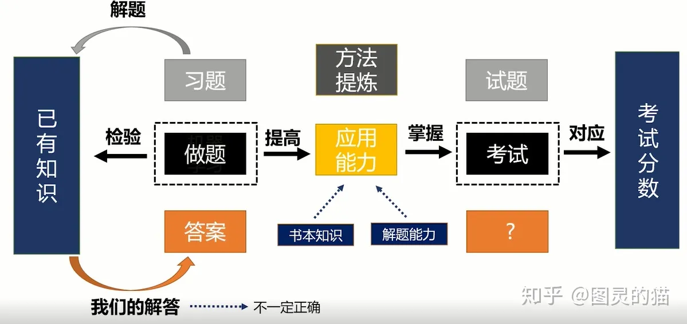
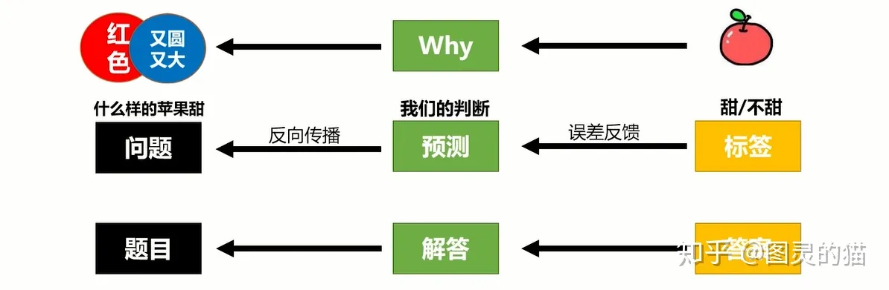

# 如何掌握新的数学概念——套公式

解决题目的方法归根到底就是套公式，简单的题目可以直接套公式，中等难度的题目需要创造条件才能套公式，难题的难点各有不同。

简单的题目往往可以直接套公式。这时候要注意题目与公式的对应关系，要搞清楚题目中的每个已知条件和所求的问题，分别对应公式中的哪些元素。

于难度适中的题目，一般有**两条思路**，**一条**是根据已知条件，结合自己掌握的公式，推算出相应的结果，研究分析这些结果能不能套入什么公式。
**另一条**是根据题目问题，反向倒推需要知道哪些信息，才能套用相应的公式求出该问题，再看看题目条件能不能推出推算出这些需要的信息。这两条思路经常要共同使用。

难度中等偏低的题目一条路就能走通，中等偏高的题目需要**从两头分析，再找到中间的连接点**。解题的过程和推理解谜是一样的。

在套公式解题目时，**首先**要注意公式中各个元素与具体题目条件的对应关系，知道这个公式最基本的用法是什么样的

**其次**要知道这个公式可以进行怎样的变形，使得它可以用于劫夺更多种类的问题，并且根据公式的变形方式，把不同种类的问题联系起来。

有时候在特定条件下，公式可以进行简化，省略去其中的一些元素，此时要弄明白简化省略的原理是什么，适用于什么条件。

练习时还要培养对公式的敏感性，能够针对一些特定的“线索条件”，推断出解决该问题最有可能会用到什么公式。

**最后**通过做题的积累和自己的“胡思乱想”，体会到公式中反映出来的一些原理性、规律性的思想，并与现实生活相联系起来。

---

详细梳理一下解题的过程：

**第1步：看到题目。**

只要眼睛没闭起来，就能以光速看到题目。

**第2步：阅读题目并分析题目。**

如果是在认真做题的话，看到题目以后就开始阅读题目了，也接近光速。除非是在心不在焉地开小差，那么这个时间可以无限长。

**第3步：想出大致的解题思路。**

这一步可短可长，跟题目的难度和自己的实力有关。简单的题目大都可以“一眼看出”所需要的思路，复杂的题目可能需要先试试看，很难的题目可能会觉得无处下手。

**第4步：一步一步推导或计算。**

这一步可短可长，与具体和题目和解题思路有很大关系。简单的题目可能一两步就算出来了，复杂的题目可能要写满一页纸。简洁的思路可能几下子就算出来了，麻烦的思路可能要经过很多步骤。
如果最后成功地得到了所求的答案（先不管对不对），那么这道题就做完了。如果计算过程中发现做不下去了，就得重新分析题目想出一个新的思路。

学霸究竟快在哪一步？**关键是第3步。**
普通人看到题目后，只有简单的题目可以“一眼看出”，对于稍复杂的题目就需要“仔细想想”，对于难题就会觉得“无从下手”。
学霸做题快，主要快在“出思路”这一步上，特别是经常能选择最简洁的思路，让“写步骤”也能节省大量时间。经常看到题目后就开始下笔计算，似乎无论题目简单还是难，基本都不会卡在这里。这一步是拉开差距的关键步骤，凡人可能是五分钟、十分钟，甚至更长，学霸基本是0！最多两三分钟。

第4步的时长与第3步提出的思路有很大的关系。简洁的思路只需要两三分钟，麻烦的思路需要五分钟十分钟。但是学霸好像总是能找到简洁的思路，凡人大多数时候需要碰运气，运气好的话时间段，运气差的话时间长。

**分析题目条件，找到解题思路，其实质就是建立起题目条件与已经学习过的知识之间的联系**。已经学过的知识就像是一章地图，题目条件和问题就像是地图上的两个地名，只要能迅速地找出地图上“条件的位置”和“问题的位置”，就能按照地图找到从条件到问题答案的路径，也就是解题思路。

按照这个“定位”和“找路径”的思路。

在学习过程中，要注意理解概念公式的意思。概念公式大多是从很多表面不同、实质相同的事物中，提取出来的共性规律。题目实际上也属于这些“表面不同、实质相同”的事物之一。要通过认真的研读课本，想明白课本上的“共性规律”是从什么地方提取出来的？被剥离掉的细枝末节都有哪些？课本上可能只有几句话、几个公式，但是话里有话、话外也有话，要尽可能把课本知识拓展开来。还是拿地图打比方，课本只是标注了几个关键的交通枢纽、主要干道、地标建筑，实际上还有大量的公交路线、车站、支路、小路、建筑，这些都需要掌握，主要通过它们与标志性建筑物之间的关系和规律来掌握。

在做题过程中，通过大量的做题，训练剥离掉表面的细枝末节、提取出共性规律的能力，提高对知识的敏感度和反应速度。同时，见识到各种各样的具体事物，各种小路岔路小建筑，不断地把“解题地图”的细节补充完善。最后，大脑就像一个高效率的导航，输入题目条件和问题的地址，就能快速地选择对用的地图，标记出它们的位置，找到可行的甚至最优的导航路线。

---

# 详解“知识点”

“知识点”可以分成三种类型：**核心的公式和概念**，**零散的事实性知识**，**推导出来的结论**。虽然它们都经常被叫作“知识点”，但是学习和使用的侧重点各有不同。

## 核心的公式和概念

核心的公式和概念是每一门课程、每一个章节最基础最重要的知识。毫不夸张地说，整个一章有时甚至整本书的内容都可以从短短几句核心的公式和概念推导出来。

其他知识的学习、做题练习往往都一定程度是围绕着核心公式概念在展开，不断地加深和拓宽对基本概念公式的理解，延申对基本概念公式的应用。

对核心概念和公式的学习是贯穿整个课程的学习的，通常不会很早地就达到“彻底学会”的程度。如果真的达到“彻底学会”的程度，就可以开始更高阶段的课程的学习了。

## 推导出来的结论

推导出来的结论的学习需要重视推导的过程，而不是单纯地死记硬背下公式。推导出来的结论通常是根据核心概念公式，使用基本的逻辑进行分析推理一步一步得到的。

虽然都是核心公式和推导的公式都是公式，但是有明显的“长辈”和“晚辈”的区别，并且“晚辈”可以再推出“晚辈”，子子孙孙无穷尽。

正是由于这些“晚辈”公式无穷尽，甚至比需要死记硬背的事实性知识还要多，因此更不可能每一个都记下来。对于它们来说，“推导”就比“记忆”要重要得多。只要大致知道它们是怎么来的，顺着逻辑这条路线往下走，就能很容易地得到次级公式。

在学习次级公式时重推导，并不意味着不需要记忆。对于做题考试以及工作科研等实际应用来说，熟练地记忆和应用一些次级公式是非常必要的。考试中没有足够时间“从零开始推导”，也只有很少的题目是用“玄学”的“学科思想”来分析解决，大多数题目都是要老老实实地使用各种常用的公式和典型的套路，有时也需要用一些小技巧来简化计算。

但是由于**各种次级公式多得数不清**，有一些甚至可能一辈子也只会遇到一道题目，因此**没有太大的必要把它们挨个梳理总结记忆出来**。这么多次级公式**其中越贴近基本概念公式的越重要，在大量做题时见得最多、用得最多，最“脸熟”的也最重要**，至于一些边边角角莫名其妙的公式，则只要**理解了它的原理和与基本概念公式之间的联系就足够**了。

## 零散的事实性知识

零散的事实性知识是主要通过记忆来掌握的内容，在文科和化学生物中尤其多。通常属于“背会就会，没背就不会”，不存在“推导出来”的可能。考察事实性知识的题目大都比较简单，大多属于“送分题”。

学习事实性知识主要靠背，“死记硬背”是一种虽然低端低效，但经常是唯一可靠的学习方法。特别是那些数量庞大又毫无规律的知识，比如语文和英语的字词句单词成语，只能依靠勤学苦练，每天抽一些时间专门背诵加深印象。

也有一些规律性很强的知识，可以用一定的规律串联起来，在记忆的时候可以借助规律来帮助记忆，捎带着能有一定“推导”的性质。比如一些相互关联的历史事件、相互作用的地形和气候、各种化学元素的结构性质、生命的结构和功能等。

其实做题也是很好的记忆方式。反复记忆背诵一成不变的概念很容易产生疲劳，也容易眼睛看见了但是没进脑子。题目虽然考察的知识始终不变，但是形式可以非常多变，做题相当于变着花样记忆，并且做题要经历从大脑中检索知识的过程，比单纯地摇头晃脑死记硬背要更加管用。

---

# 如何做到“理解知识”

老师和学霸们总是一再强调“要理解知识”，“不要死记硬背”，但是却很少有人说过究竟怎样才叫“理解”？这里用最简单直白的方法说明如何做到“理解”。

我们所学习的“知识”，主要包括三个方面：**事实、规律、推论**。

## 事实

**事实就是事实**。也就是客观的现实，是真实发生的事情，比如1+1=2，苹果从树上落下等等，根据现实生活经验，一个东西和另一个东西放在一起就是两个东西，地球上任何地方的苹果树上的苹果都会自然地落到地上。

事实是最基本的知识，事实性的知识是学习知识的基础，也是最简单的知识。事实只能知道、接受、记住。

学习**最基本的事实**一般**只能靠记忆**，谈不上理解，但可以通过规律和规律帮助记忆。比如，小时候学习拼音、汉字、十以内加减法、乘法口诀表、英文单词等，都主要靠记忆，完全不需要动脑子就能脱口而出。

## 规律

**规律是大量事实的共同点**。一条规律可以体现无穷多事实的共同特点。规律是从大量事实中总结出来的，根据事实中积累的经验可以感知到规律，借助规律可以帮助记忆大量的事实。

比如，牛顿运动定律概括了宏观、低速状态下物体的运动规律，不管是苹果从树上落下，还是小车在地面上刹车，还是行星绕恒星运动，都遵循牛顿运动定律。因此，使用牛顿运动定律可以分析计算出各种物体的运动状态。

元素周期律概括了化学元素的化学性质随着原子序数增加发生周期性变化的规律。虽然元素周期律中有很多特例，但是整体上特别是高中阶段学习的内容还算比较符合这个规律。根据元素周期律可以帮助记忆很多化学元素的性质，也可以推测出一些化学元素的性质。

学习规律主要也是需要记忆，可以根据最基本的事实和日常经验帮助记忆，以及通过充分的练习反复使用规律来强化记忆，并帮助理解不同情形中的共性规律与个性化差异。

理解规律是**理解事实的共性特点**，**剥离**出**事实的个性化差异**的**过程**。

## 推论

**推论是根据客观的规律和严谨的逻辑分析推理出的结论**。

推论是由规律与逻辑分析推理共同得出的结论。**学习推论一方面要对事实和规律掌握地很清晰**，**另一方面需要良好的逻辑能力**。推论在数学的学习和解题中最常见。

基本的逻辑在高中数学开篇所学习的集合与命题中有所介绍，主要包括划定讨论范围的集合，交集、补集、并集等概念。还有判断事件成立条件及真假关系充分条件、必要条件等。以及集合与命题之间的对应关系。

**在数学公式的推导变形中，等号相当于充分必要条件，从一个等式变形推导出另一个等式**。联立等式解方程组相当于求集合的交集，方程组的解就是同时满足这些条件的共同的数值。

比如：根据日常生活中最基本的事实：正整数的加法。将加法变成逆运算就得到了减法。减法遇到不够减的时候，于是出现了负整数。

若干个相同的数字相加，于是出现了乘法。将乘法变成逆运算就得到了除法。除法遇到除不尽的时候，就出现了分数。

若干个相同的数字相乘，于是出现了乘方运算。将乘方变成逆运算，就得到了开方运算。开方遇到开不下去的情况，就出现了无理数。

此外，将乘方看作指数运算，指数的逆运算还能得到对数运算。

根据加减法的交换律和结合律可以得到乘法的交换律、结合律、分配律。根据乘法的计算规律，可以推导出乘方的一些计算规律，根据乘方的计算规律，可以推导出指数和对数运算的计算规律。每一步都环环相扣。

三角函数、解析几何、计数原理等等都是如此。都能从最基本、最直白的日常经验性的事实和规律，一步一步分析推导出大量看起来或简单或复杂的结论。

综上，所学习的每一个知识，都**要么就是客观事实**，**要么是大量事实的共性规律**，即“就是这样”。**要么是根据事实和规律一步一步推导出的推论**，有它的“因为所以”。没有任何知识是“不明不白”的，**这就是所谓的“理解知识”**。（个人理解：客观事实，共性规律这2个方面都是单纯要背诵的，推导出来的推论是在背诵的前提下选择性的挑选与核心公式接近的推论来背诵）

理解知识是使用知识的前提，理解知识对于使用知识有很大帮助。除了**最基本的事实几乎只能靠死记硬背**来使用外，**理解规律是理解事实的共性特点，剥离出事实的个性化差异的过程**。在实用知识和**做题考试**时，也是**需要剥离题目的个性化差异**，**运用其符合规律的共性特点分析解决问题**。

从事实和规律推导出推论，是使用逻辑分析推理的过程。而使用和解题，也非常需要使用**逻辑分析推理来拆解题目**，将**已知条件进行对应、变形、推导，使得其与系统的知识相一致，再利用知识将进行处理，得到结果**。

---

# 解题的基本方法：对应与还原

虽然把理论与实践相脱节的“纸上谈兵”不可取，但是能熟练使用理论解决纸面问题往往是解决实际问题的前提。并且科学理论高度系统化、公式化，解决实际问题往往需要先将其转化为抽象的纸面问题，解决纸面问题就是解决实际问题的一部分。

**还原与对应是解决问题的基本方法。**

所谓**对应**，就是把**题目条件和问题与所学习的公式中的内容一一对应起来。**

所谓**还原**，就是把**整个题目还原成已经学习的公式或推论。归根结底，就是“套公式”**。

课本中的知识是前人观察、总结、分析、推理出的客观事实或共性规律，公式就是从数不清的具体情景中总结概括出来的，而要解决的题目就是体现这些规律的具体情景之一。所谓“以不变应万变”，不变的是事物的共性规律，变化的是具体的情形。

其实从念小学就开始学习使用套公式，只是当时套得太自然，所以感觉不出来。刚学十以内的加减法时，就明确了减法是加法的逆运算，若a+b=c，那么c-b=a。学习了1+2=3之后，就可以套公式学3-1=2。这就是最早的套公式。

虽然学习的公式越来越多，越来越复杂，套公式的难度也越来越难。这时候就需要理解复杂的公式究竟是怎么来的，用“套公式”的方法学习新的公式，一直套到不能再套，与最直白、简单、普遍的现实规律相对应为止。

比如在学习幂运算时，公式a^m×a^n=a^(m+n)，就可以根据指数的定义把a^m还原成a×a×... ×a(m个a),把a^n还原成a×a×... ×a(n个a)，所以a^m×a^n就是m+n个a相乘，根据指数运算的定义就是a^(m+n)。

训练对应和还原的能力，要多思考和练习。学习新的知识时，要彻底打开思路，多从已学的知识中、现实生活中、书籍影视剧、个人爱好中去寻找与之有关联的事物，找到他们之间的关系，最好能直接体现出课本知识，把枯燥的知识和活生生的现实联系起来，一一对应起来。

随着学习的知识越来越复杂和深入，一定要理清知识之间的逻辑关系。要明确地把知识分为两类：

一类是**直接反映现实规律的知识**，“就是这样，不需要解释”，比如数学中的排列组合的乘法原理和加法原理，三角函数中单位圆半径旋转时横坐标和纵坐标的变化情况，牛顿运动定律，万有引力定律，原子的电子的排布规律等，这些都是铁一般的事实，或者当且学习的理论还不能解释，要像1+1=2一样牢记。

另一类是**推导总结出来的知识**，比如排列数和组合数的计算公式，二项式定律，匀速圆周运动的向心力F=mv^2/r，元素周期律等等。这些知识往往以上一类知识为基础，使用数学或逻辑分析推导出来的，有着较为严谨确切的分析推理和概括总结的过程，就像上楼梯一样，每一级台阶都有迹可循。

有些推导出来的知识也直接反映客观现实，比如动量守恒定律实际上是通过实验总结验证的，但是它们也可以与牛顿运动定律等更简洁的知识相联系或推导出来。**此时不必纠结于谁更“基本”，谁更“高级”，掌握相互推导转化即可**，有兴趣的话可以读些科学史，了解这些理论在发展中的相互关系，以及科学家之间的爱恨情仇。

虽然做对题目很重要，更重要的是理解自己怎么做对题目的，不能对得莫名其妙。实际考试做题时，题目往往经过了隐藏和变形，不能直接套用公式。如果不能直接套公式，那就需要多套几次公式，套不同的公式。

先**根据题目的条件和问题，大致判断出题目涉及的块面，确认这个块面中最基本、最重要、最常用的几个公式。**

然后**把题目条件和问题与这些公式中的要素比较一下，看看有没有能直接对应的或者相似的，找到最有可能用到的那个公式。**

接下来**看看其他没法直接对应到公式中的条件，利用他们能分析、推导、计算出什么新的条件和数据，从中找出能套到公式上的。**

此外**也可以根据所求的问题倒推，把已经能对应到公式中的条件和问题都写出来，看看还缺什么条件，然后想方设法去凑这些缺少的条件。**

如果一个公式实在套不出来，可以再试试其他有可能的公式，甚至要大胆地瞎试和乱试，能得出什么新结论都先放着，再从里面找熟悉可用的。

---

# 学习“抽象”离不开“现象”

今天分享究竟什么是抽象思维，究竟如何培养抽象思维。

与“抽象”对立的名词是“现象”。现象很容易理解，就是能被直观地看到、听到、摸到、闻到等直接感知的信息，比如个数的多少、面积的大小、物体的材料、气味的香臭等到。现象是日常生活中随时随地都在接收到的信号。

“抽象”就是把各种看上去**不同的现象的共同点提炼出来，再用一定的语言或者符号表示的方法**。比如用数字可以表示个数和面积，用化学符号和成分比例可以表示物体的材料，用语言文字或者化学分子可以表示具体的气味。

“抽象”的概念与具体的“现象”之间既有联系，又有区别。联系就是“抽象”都存在于“现象”之中，每个“现象”里都蕴含着“抽象”。区别就是“抽象”是很多不同“现象”的共性规律，需要把个性化的细枝末节剥掉。

学习“抽象”的概念时，需要从具体“现象”入手，否则就成了死记硬背的“空中楼阁”。等通过充分的学习和练习，能非常熟悉地掌握“现象”与“抽象”之间的联系之后，就可以抛开“现象”直接分析处理“抽象”了。

比如，三角函数是高中数学里比较复杂的一个块面，但是三角函数的“现象”非常直白明了：就是单位圆的半径绕圆心旋转时，半径端点的横坐标、纵坐标、横纵坐标比随着旋转的幅度发生的规律变化。可以通过想象或者作示意图或者观看动画视频的方式，直观地体会这个变化的“现象”，就能很好地理解三角函数的基本特点和规律。三角函数的平移变换、伸缩变换等也都可以结合函数图像观察理解。

在分析处理纯“抽象”问题时，特别是具体的应用题时，也可以偶尔把“抽象”还原成“现象”，看看这个“抽象”是怎么描述“现象”的，提取出来的是哪些信息？被剥离掉了的又是哪些内容？

对于日常生活中的种种“现象”，也要怀揣着寻找“抽象”的眼睛，从中找到所学习的“抽象”的规律，进行描述、解释、分析和思考。

## 数学图像

**对数学底层逻辑的直观训练**，这里有两个关键词——底层逻辑、直观训练。认识和训练出抽象数学逻辑的数学图像。

举个例子来讲。比如讲函数平移的时候，有个口诀，叫“左加右减，上加下减”，也就是说对于函数 y=f（x）来说，y=f（x+a）是向左平移a个单位，如果a前面是负号，那就是向右平移。而 y=f（x）+b，则是向上平移b个单位，如果b前面是负号，那就是向下平移。

一定要逼着去描点画图的，逼着举一个示例函数，把y=f（x）的图像画出来后，再去画y=f（x+a）。直观地看到在x后面加个a，对应到图像上到底是对函数上的每个点做了种什么操作。

实际上高考真题直接套用这个口诀就能快速解决的问题相当地少，一般都综合着其他知识点，而且有时候是把条件结论颠倒过来问你。尤其是条件结论一颠倒，没经过扎实的底层逻辑训练的学生，脑子立马就短路了。

有没有尝试过分析乘法分配率和乘法竖式计算之间的关系，这两者之间的关系对于高中生来说是很容易理解的。他们只是不知道——理解这些有什么用，陷入茫然。

知道竖式运算和乘法分配律之间的关系有什么用？

**它帮助你建立起一种确信感，一种对直觉的确信感，一种意识到所有的数学操作背后都有严格的逻辑保障的安定感。**

数学是一门高度抽象的学科，但是数学学得好的人很少在抽象中思考数学问题，他们一定是要把数学直观化的（至少现代代数之前的数学肯定是如此）。

数学课本上教授给你的符号工具和图像工具，其实就是把数学直观化的工具。

数学直观化图像化，这种训练**最重要的作用就是让你意识到——所有所谓的“数学方法”都不过是对某种底层数学原理的简化运用罢了**，哪怕课本上教的那些“成熟方法”本质也不过如此。

**这意味着，当解题没有方法没有思路的时候，你完全可以回归底层原理，从最基础的原理层面把方法一点点推导创造出来，而不是指望着某个“名师”来告诉你这种类型的题目有某种解题套路。**

而这种**从底层原理把方法推导创造出来的能力，不可能凭空发生，是必须要反复训练的**。从来不做这样的训练，那你面对中等难度以上的没见过的问题，就是会没有思路，甚至对于见过的问题，只要稍一变换条件，立马就蒙圈了。

---

# 从“看懂书”到“做出题”

很多同学在学习过程中都会遇到看书与做题难以衔接的问题。虽然书上的内容都看懂了，例题好像也就那么回事，但是真到开始做题，就会发现好像毫无头绪。今天分享怎样从看懂书变得能做出题。

一方面，看懂书和做出题不是完全分裂的。不是说看懂书到一定程度之后，就突然一下子能做出题了。实际上，看懂书和做出提是相互缠绕在一起的。看懂一点书，能做出最简单的题目。看得更懂一些，就能做出适中的题目。看得非常懂了，就能做出比较难的题目了。

另一方面，不仅看懂书到什么程度，能做出什么程度题，反过来，做题练习的过程，也是在帮助理解消化课本里的知识，分析思考题目也是加深对知识理解的深度、拓宽对知识理解的广度的过程。

因此，看书和做题要相互衔接、循序渐进地进行。从最开始看不懂书、做不出题，到最后透彻全面准确地理解概念、灵活熟练地解决题目。

由于课本上的内容都是已经写得明明白白的，单纯从这些语句中很能从零开始看出什么。而题目是有简单、中等、困难的区分，从不同难度的题目入手，恰好可以与理解课本知识的程度相对应。

题目难度的划分与经验直觉一致，自己和大多数同学觉得简单就简单，自己和大多数同学觉得难就难。

## 难度划分

**第一阶段**：**简单题，套用公式**

最简单的题目就是套公式，把课本里现成的公式抄下来，然后从题目条件里找，看每个条件分别对应公式里的哪个元素。等到把题目条件都对应完了，最后剩下的就是题目要求的答案。

套公式虽然看起来很无脑，只是单纯的抄公式和代入数据，其实代入数据的过程，就是理解公式的过程。能够从题目的语句中找到与公式对应的数值，其实就已经对公式有了初步的了解。

能够把公式中抽象的字母与各种各样具体题目中的数据对应起来，是学习理解概念的第一步。

**第二阶段**：**中等题，创造条件**

中等难度的题目虽然不能直接套公式，但是**通过对公式变形、使用其他公式等方式，最终能够创造出直接套公式的条件**。

将公式变形就可以认识公式不同的变化形式，掌握更多使用公式的方式。

将多个公式共同使用，有助于建立起多个概念之间的联系。一步一步创造条件，也是训练推理和分析能力的重要方法。

只要能顺利地做出中等难度的题目，就可以说对概念已经有了充分的理解，已经可以继续学习更新的章节，也足以应对考试中的大部分题目。

**第三阶段**：**困难题，分析推理**。

对于困难的题目，其**难点其实已经不在于知识概念本身**，而**在于分析、推理的能力**有多强，对一些重要的**方法和技巧的掌握有多熟练**，甚至**对一些特殊值或特殊情况有多敏感**。

训练分析解决困难题目，已经很大程度上超出了知识本身，而是更多地体现为对思维方法的训练，而这种训练是没有上限的。

因此对于一些很难的题目，没有必要一心死磕把它做出来，只要能够穷尽自己能想到的方法，尝试各种看起来不太靠谱的思路，甚至瞎试乱试一通，达到训练的目的即可。

有必要的话，可以把参考答案中的思路、方法、关键步骤当作知识认真学习理解一番。

普通学生很难盯着课本，光靠“悟”去悟出这些经验，这些经验主要靠大量做题获得的，获得之后才会回头发现它们是课本表层知识的内在映射。比如什么条件用什么推论，什么时候满足什么条件，普通学生看完课本是很难分辨出来的。与其让他们自己悟，不如给他们一堆题再好好讲需要理解知识到什么地步。但这就是出题辅导者的教学智慧了。

---

# 图灵的猫的内容

人类本身偏好短期反馈行为，短期奖励预期会令脑垂体腺分泌强烈的多巴胺，并促使大脑发出信号，不断影响你的行为冲动，使你获取更容易得到反馈的东西。

而这，也是我们喜欢玩游戏、看B站，却不善于享受学习的原因——人类偏好短期反馈行为。

## 当我们做题时，我们究竟在做什么

做题，是对已有知识的检验。

通过做题，我们根据已学到的知识和解题方法，对题目做出“解答”。这个“解答”不一定正确，它取决于我们对已有知识的应用能力。我们要做的，就是在不断练习中，提高这种“能力”，并尽可能的得出与真实答案一致的“解答”。

这个过程中我们学习到的应用能力，就是做题的本质——方法提炼。

通过已有的习题和答案，我们在做题中不断进行方法提炼，不仅验证了自己所学到的书本知识，也补全了自己的解题能力。在答案未知的“考试”中，我们对能力的掌握程度，直接对应了考试分数的高低。

在人工智能中，我们把这件事称为机器学习。

### 机器学习

机器学习在做的事，其实就是模仿我们平时的学习模式。

### 为什么看答案会影响做题效果

大家是否有过这样的体验——有时候看完答案，觉得自己已经掌握了题目解法，但是每当在考试中遇到相同题型的新变化时，却突然丧失了这种能力。这是我们的错觉吗?
并不是。这种现象由三种缺失造成：

有的人平时看似努力，做的题不少，但一到考试就失手——**回路缺失**。
有的人做题缺乏耐心，无法进入沉浸状态，越做越烦躁——**反馈缺失**。
有的人由于总是遇到没见过的题，缺少信心反馈，做题变成煎熬，题量也比其他人少——**数据缺失**。

回路缺失:

做题，可以看作一个“题目->解答->验证”的反馈回路（中间是**大脑**）。不断的做题过程，就是构造一个完整的循环，并通过误差反馈进行学习，持续增加**模型（大脑）**的解题能力。

回路在正常情况下是 “题目-解题-验证”，而跳过“解题”直接获得“验证”，就会造成回路缺失。这时大脑将更多地调用记忆功能，而非归纳推理功能。最直接的影响就是，当你做过1道题，就只吸收了这1道题本身具有的信息，却不能举一反三，解出任一该类型的题目，做题收益自然低。

反馈缺失:

当自己的“解答”和正确答案一致时，我们的大脑会获得短暂的愉悦和满足——这和王者荣耀本质上一样。

看答案，就是跳过了“解答”过程，直接在“题目”和“验证”间进行反馈传播，虽然缩短了反馈周期，但却缺少了最重要的“解题”反馈。

换句话说，大脑已经预付了一部分多巴胺，导致你在题目-解题-验证的反馈回路中所获得的快感预期总量减少，无法构造连续的回路。**做题效率**自然也不会高。

数据缺失:

数据缺失，意味着你的题目储备比别人要少，只能在考试中花更多时间去探索，有时甚至做不完试卷。

但题海战术有提升瓶颈，也没有从根本上提高学习能力。真正的问题在于反馈缺失和回路缺失，这两个缺失。

它们构成循环，互为因果，是提高做题收益与效率的最大障碍。而考试，就是对收益与效率的检验。

我们平时做题，最希望的就是在考试中能碰到原题，这样不必探索就能迅速写出正确答案。如果平时的模拟考都是原题或与之相似的题目，学生自然都能取得不错的成绩。只有在未曾出现原题的考试中，才会体现不同学习者所提炼的“方法”的好坏：擅长记忆题型、答案的人，成绩会明显低于通过做题高效地掌握了题目规律的人。

## 如何提高做题效率和收益

考试的目的，是筛选出有“方法学习”能力的学生，而不是“见过类似题目并记住了答案”的学生。如何解决这3个问题，增加自己的应试能力？这里简单给出6个方法

1. 梯形练习：AI系统的准确率是随着训练不断提升的，做题也是如此。

习题难度取决于你当前的知识水平和解题能力，首先要对自己的区间进行定位，比如：正确率80%---30%，**不要一直做100%能做对的题，也不要做只能对10%的题**。前者缺乏误差反馈，后者缺乏信心反馈。循序渐进，每次提高一个台阶，而不是一蹴而就。
2. 答案屏蔽：做题之前，不要将答案放在自己触手可及的地方，弱化大脑冲动。在习题难度适中的情况下，如果出现无法解出的题目，先试着在没有答案时利用已有的解题技巧进行推导，能写多少就写多少。
3. 难度阈值：将难度具体化为时间。一旦在某道题上花费的时间超过某个时间阈值，比如30分钟，你还没有头绪。那么基本可以判断你没有掌握这道题对应的知识储备或解题方法，也即你此时并不适合做这道题。你可以将这道题进行记录，但不要翻看答案。根据这道题上花费的时间，你的习题本可以按照阈值分级，比如花1分钟解出的题，花10分钟解出的题和花10分钟未解出的题等，并按照梯形练习法刷题。
4. 误差传播：机器的学习模式是通过结果反推，利用预测（解答）与标签（答案）间的误差进行反向传播。我们可以针对已记录的错题，利用答案进行反推，也就是从题目—解答—答案，变为答案—解答—题目的逻辑顺序。对应到买苹果中，就是从“甜苹果”出发，学习为什么这个苹果甜，并最终析构出“红色”和“又圆又大”的因子，这个因子，就是做题时，题目的归纳性特点。

5. 答案反馈：在构建了完整做题回路的前提下，我们可以进一步增加答案的反馈：
5.1.提高答案的误差反馈，比如积累每个梯形台阶的错题，整理成阶段错题本，定期复习，这样可以同时利用大脑的记忆和学习功能，强化答案对“解题能力”的误差反馈。
5.2.增加答案的快感反馈，比如每答对10道题可以玩10分钟手游或者看10分钟B站-设置奖励点，促进多巴胺分泌，可以更容易进入沉浸状态。
6. 数据增强：真正的学习能力，可以让我们即使碰到未见过的题型，也能根据已有知识储备，正确的推导出答案。这就是为什么学霸在考试中遇到超纲的“附加题”也能写出答案的原因。在平时做题中，可以有针对地训练大脑归纳、推理功能。人工智能在学习时可以通过一种“数据增强”方法来生成和原数据（苹果）相同分布的新数据（试题）并进行自我训练，做题也是一样：每做完一类题，我们可以试着根据题型归纳出这类题的特点，然后给自己出题做。在出题过程中，你的归纳推理能力会不断得到提高，并且会更加了解题型的特点（也即数据分布，或者说又大又圆和深红色2个因子）。

要学会保持耐心，持之以恒。在保证效率和收益的前提下，增加题量储备，是提高成绩最有效的方法，所以，也别忘了多刷刷题~

---

上课听懂会做题，考试就不会？

上课听懂了——从已知结果推导出整个思路，比凭空产生思路容易。“接受”远远比“产生”容易的多。

听懂而不会，是缺乏思考和动手能力的表现。思维上的欠缺，指的是对问题思考的不足，不善于**分析条件和问题之间的关联性**。

要学会逆向思维：想获得什么结论，就要搞清楚前提条件是什么。应该始终从题目出发，思考题目的问题和条件，而不是凭空套用题目。平时多思考试题条件与问题之间的关联性。多花费一些时间“看”题，看每个步骤之间的思维转变，步骤与步骤之间是如何产生推导的。

---

# debug过程产生的现象和结论

现象1 git 在电脑上无法判断装还是没有装，因为之前记忆中存在删除git的操作

现象2 鼠标右键出现git base，但是在VS上源代码管理无法找出git的安装目录（在C盘上找不出）

装还是没有装，鼠标右键出现git base，这个现象是说明安装了，但是为什么没有确定安装呢，因为VS上的源代码管理无法找出git的安装目录（在C盘上找不出）和记忆中存在删除git的操作

解决：上网查确定电脑已经安装了git，

还未解决：VS源代码管理无法找出git的安装目录（没有意识到VS关联git是需要自己配置的，完全自认为VS会自动关联git），所以就寻找电脑环境配置，就像Java那样配置。

解决过程：在寻找电脑环境配置过程中，在win查找git，找到后右键点击选择git的打开所在文件位置，发现自己把git安装在G盘，不是在C盘，所以VS就找不到git的安装目录，然后就修改VS寻找git的安装目录。

问题2： VS的终端启动后读取的是C盘的起始按照文件，不是当前项目的文件，想要git启动还要cd跳转到当前项目文件，不知道怎么提问。

解决：网上搜索关键词---VS终端 + 启动读取不了当前项目文件

得出结论：
第一个结论：一定要按照debug的思路去解决，出现什么问题就只寻找解决这个问题的内容，就是突出一个形式逻辑。不要自以为是，自己脑子里面的设想是完美构想，不是实际的事实。

第二个结论：提出XXX问题就是要XXX关键字 + XXX关键字 + XXX关键字 这样的形式去提问，当搜不出来的时候就换一个词继续提问，不断更新迭代，就会不断接近符合自己构想的那个问题。

---

# 学习秘诀与经验

最有效的学习方法就是紧扣基本概念，也就是课本上最原始的定义、概念、定理、定律，通常是黑体字或者加粗字体。只要真正做到把课本上的基本概念**全面、准确、深入**的理解掌握了，能够灵活地运用，那么90%的题目都能用完全正统的方法顺理成章地求解。

比如数学几乎全都围绕函数，通过确立函数关系，用已知量求出未知量，或者证明结论。向量的核心就是坐标化以及用勾股定理求距离和角度。

比如物理中的牛顿运动定律：a=F/m的矢量运算，机械运动、能量守恒、电场磁场都能用牛顿定律推出来。

比如化学中的周期律，所有元素的性质都能用电子层的2n^2、全满半满稳定性、原子半径推理，然后根据“结构决定性质，性质决定行为（化合物和反应）”的思路推理，有机也是如此，把原子结构换成官能团结构即可。

## 首先要思考

看课本的时候一定要多想。对基本概念一定要逐字逐符号地翻译。把每个出现的字的意思都理解透彻，甚至要想到没有出现的字为什么没有出现？如果出现了会造成什么影响？

比如物理，要把每个抽象的物理量与现实中的情况对应起来，知道这个物理量表示什么？是怎么测量的？物理公式表示现实中的什么情况？

做到真正理解概念，要能完全用自己的话无中生有自言自语地把概念讲述出来，要能给没听说过的人用对方能够理解的话语给对方讲明白，而不是死记硬背语句和公式。

## 其次是做题

做题的目的不是得到答案，而是通过实际应用不断地加深和拓宽对基础概念的理解。每看到一道题目，都要认真想想

（1）这道题目的条件对应的是哪块的知识？

（2）这块知识的基本概念有哪些？

（3）这些基本概念有哪些基本公式和常用的次级公式？

然后把题目条件与公式相对应，逐步简化条件，求解答案。做完后再回过头来思考：

原本那么精炼的基本概念，是怎么变成这么复杂的题目的？

缺少了哪些条件？

或者哪些条件改变了形式？使得题目看起来不那么直接。如何能从题目的只言片语中找到正确的求解思路？

## 最后是总结提炼

还有10%的题目是用正统做法做不出来或者很难做出来，这时候需要总结提炼一些经典常用的思路。

比如伸缩求和法、辗转相除法、构造函数、利用单调性（导数）证明不等式、洛必达法则，等等。

首先要搞清楚这些经典思路的原理，要能够做到从头开始推导出来，这是最重要的。通过多次地使用训练记忆下来只是其次。千万不要对着目录死记硬背一堆原理不明的“秒杀方法”“高阶技巧”。

---

# 参考：

https://www.zhihu.com/people/rq-cen/columns

https://www.zhihu.com/column/c_1168285492755283968

图灵的猫：https://zhuanlan.zhihu.com/p/104622915

