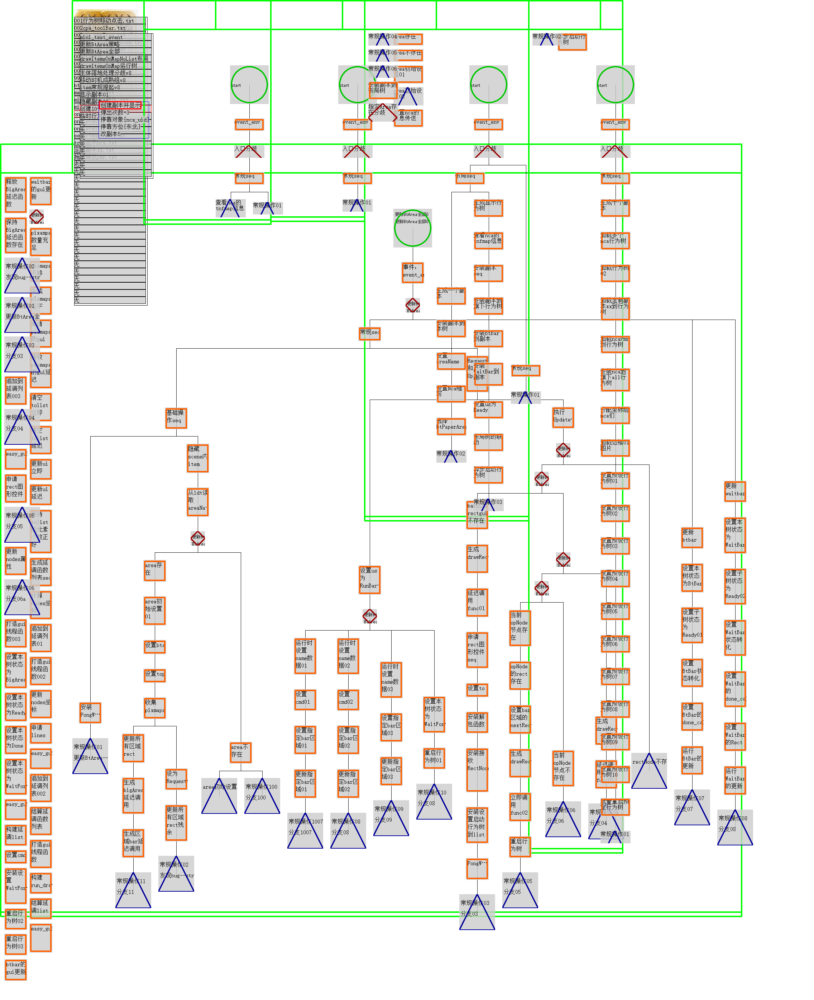

# 行程问题

## 初步

行程三要素：路程，时间，速度，**题目一般是知2求1**

要素1： 同路段分析（路程相同）

$V_{甲} \times T_{甲} = V_{乙} \times T_{乙}$

要素2： 同人物分析（速度相同）

$\frac{S_{甲}}{T_{甲}} = \frac{S_{乙}}{T_{乙}}$

要素3： 同时段分析（时间相同）

$\frac{S_{甲}}{V_{甲}} = \frac{S_{乙}}{V_{乙}}$

找等量关系：直接**变量相等**，**和差数量**或者**倍比数量**相等

## 正片

### 相遇问题（相向）

路程和 = 速度和 $\times$ 相遇时间

### 追击问题（同向）

路程差 = 速度差 $\times$ 追击时间

追击时间 = 路程差 $\div$ 速度差

**路程差**的解释：比如你的速度是5米/秒,你前方100米处的小明速度是3米/秒那么每秒你跑5米,小明跑3米,你们俩的距离变成100+3-5=98米,即每秒你们两人的距离减少2米（5-3=2）因此,当你追上小明时,也就是你们俩距离变成0了。

### 多次相遇问题

同时异地出发：
第一次相遇，甲乙合起来走 1个全程，此时也可以看作甲一个全程走XXX米，乙一个全程走YYY米

第二次相遇，甲乙合起来走，3个全程，此时也可以看作甲三个全程走（XXX）$\times$ 3米，乙一个全程走(YYY) $\times$ 3米，再画出路程图，对比一个路程全程，看差值是不是题目给的那个距离A地RRR米。

这类题目核心等量关系：**第二次相遇甲/乙走的部分 与1个全路程 + 题目给的差值 是等量的**。

### 平均速度

题型1 ： 平均速度 = 总路程 $\div$ 总时间

题型2： 两段时间相同的时间段，有2个不同的速度，那么可以说两段相同时间的平均速度就等于两个速度的平均数。

题型3： 缺条件，那么就缺什么设什么。

---

## 火车问题

核心：长度，速度，2个对象之间的相对运动

具体描述：

### 1火车过杆

杆：无长度，无速度

火车路程 = 车长 = V $\times$ t

---

### 2火车过桥

桥：有长度，无速度

**题型1**----完全**过**了桥/隧道：从车头上桥，到车尾离开桥的过程

火车路程 = 桥长度 + 车长 = V $\times$ t

**题型2**----完全**在**桥/隧道上 ：从车 尾上桥，到车头开始离开桥的过程。

火车路程 = 桥长度 - 车长 = V $\times$ t

---

### 3火车过人

人： 无长度，有速度

**相遇类题型**： 车与人的**方向相向/相对**，从车头与人相遇开始计时，到车尾离开人的过程（路程和 = 车长）

车长 = $ S_{车} + S_{人} $ = 路程和 = $ (V_{车} + V_{人} ) \times T$

常使用的公式形态：车长 = $ (V_{车} + V_{人} ) \times T$

**追及类题型**：车与人的**方向相同**，从车头追上人，与人在同一起跑线上时开始计时，到车尾离开人的过程（路程差 = 车长）

车长 = $ S_{车} - S_{人} $ = 路程差 = $ (V_{车} - V_{人}) \times T$

常使用的公式形态：车长 = $ (V_{车} - V_{人} ) \times T$

---

### 4火车过火车

火车：有长度，有速度

**相遇（错车）题型**：车与车的**方向相向/相对**，根据2车的路程和进行分析展开计算。 从2车车头相遇开始计时，到车尾相遇的过程。

路程和 = $ S_{快车} + S_{慢车} $ = 快车长 + 慢车长 = $ (V_{快车} + V_{慢车} ) \times T$

常使用的公式形态：2车车长之和 = $ (V_{快车} + V_{慢车} ) \times T$
可以看作2车车头相遇开始计时，2个车尾相遇的路程和是多少。

**坐在A车看B车，看谁就是谁，谁就是基准（B车长是路程和）** ，其实就是相对论里面计算物体运动的极度简化版

**追击（超车）题型**：车与车的**方向相同**，根据2车的路程和进行分析展开计算。

路程差 = $ S_{快车} - S_{慢车} $ = 快车长 + 慢车长 = $ (V_{快车} - V_{慢车} ) \times T$

常使用的公式形态：2车车长之和 = $ (V_{快车} - V_{慢车} ) \times T$

---

## 环形跑道

第一结论：如果同一地点同时反向出发，则每相遇一次，就是合走完一圈。

### 环形跑道的相遇（相向，反向）

**同一地点同时相向，反向启动类型**：每相遇一次，合走一圈，相遇n次，合走n圈

**不同地点同时相向，反向启动类型**：第一次相遇合走部分路程（一定不是一圈的路程），之后的每次相遇，都是合走一圈的路程。本质第一次不是同一地点同时相向，反向启动，第二次开始就是同一地点同时相向，反向启动类型。

### 环形跑道的追及（同向）

**同一地点同时同向启动类型**：每追上1次，多走一圈。 追上n次，多走n圈。

例子：1天24小时，分针跑了24圈，时针跑了2圈（1圈12个小时），分针多跑了24-2 = 22圈，追上了22次，多走了22圈。

**不同地点同时同向启动类型**：第一次追上的部分路程（一定不是一圈的路程）就是起点之间的路程差，之后的每次相遇，都是多走一圈的路程。本质第一次不是同一地点同时同向启动，第二次开始就是同一地点同时同向启动类型。

---

## 流水行船

水平方向的扶梯问题

---

## 扶梯与发车

### 扶梯问题

电梯可见的级数（不变量）

电梯与人的4种状态：

状态1---人动电梯不动： 可见级数（路程） = $V_{人} \times T$

状态2---人不动电梯动： 可见级数（路程） = $V_{电梯} \times T$

状态3---人与电梯相同方向动： 可见级数（路程） = $(V_{人} + V_{电梯})\times T$

状态4---人与电梯相反方向动： 可见级数（路程） = $(V_{人} - V_{电梯})\times T$

方程法：根据可见级数不变，而设置等量关系
要求题目分别给出甲乙2人的速度，电梯在甲乙的速度下分别走完路程的时间，才能用。简单说是要求已知4个变量

2人甲乙与电梯的关系，设 $ V_{电梯} = X ，同时设置V_{甲}和T_{甲}，V_{乙}和T_{乙}$

2人有3种类型：

2人都是与电梯相同方向类型（顺顺型）：$(V_{甲} + X) \times T_{甲} = (V_{乙} + X) \times T_{乙}$

2人都是与电梯相反方向类型（逆逆型）： $(V_{甲} - X) \times T_{甲} = (V_{乙} - X) \times T_{乙}$

2人中一个与电梯相同方向，另外一个与电梯相反方向类型（顺逆型）：$(V_{甲} + X) \times T_{甲} = (V_{乙} - X) \times T_{乙}$

---

## 发车问题

车间距（不变量） = 车速 X  时间间隔

相遇类型题目：车间距 = $ S_{和} = (V_{车} + V_{人})\times T$

追及类型题目：车间距 = $ S_{差} = (V_{车} - V_{人})\times T$

方程法：根据车间距不变，而设置等量关系
要求题目分别给出甲乙2人的速度，车分别遇上和追上甲乙的时间，才能用。简单说是要求已知4个变量

2人甲乙与车的关系，设 $ V_{车} = X ，同时设置V_{甲}和T_{甲}，V_{乙}和T_{乙}$

2人有3种类型：

2人都是与车相反方向类型（遇遇型）：$(V_{甲} + X) \times T_{甲} = (V_{乙} + X) \times T_{乙}$

2人都是与车相同方向类型（追追型）： $(V_{甲} - X) \times T_{甲} = (V_{乙} - X) \times T_{乙}$

2人中一个与车相同方向，另外一个与车相反方向类型（遇追型）：$(V_{甲} + X) \times T_{甲} = (V_{乙} - X) \times T_{乙}$

核心思想：无论扶梯问题还是发车问题，最终题目问的问题是跟人的速度是没有关系的，只有与车速度有关系，就是人的速度用车速来表示。

只给时间，没有给速度的题目，一般明显缺失变量的题目，都是要求你用XXX对象的属性来代表描述YYY对象的属性，也可以用设未知数来表示各个变量，玩的就是变量等量替换。

例子：
甲乙两地是电车的始发站,每隔一定的时间两地同时各发一辆电车,小张和小王分别骑车同时从甲乙两地出发,相向而行,
每辆电车都隔6分钟遇到迎面开来的电车,小张每隔8分钟遇到迎面开来的的一辆电车,小王每隔9分钟遇到迎面开来的一辆电车,
已知电车行完全程要用45分钟,求小张与小王相遇时走了多少分钟?

题目解析：
电车行完全程要用45分钟，这是已知全程路程，用电车的属性来描述全程路程。

求小张与小王相遇时走了多少分钟，这是明确要求的对象是相遇时间。

根据已知用电车的属性来描述全程路程，并且求的是全程路程的相遇时间，所以确定要用电车的属性来作为基准，去描述其他对象的属性。

接下来就是把电车的属性与其他对象的属性进行关联，找出等量关系，是最好描述的。

根据车间距不变，题目给出时间条件，所以大概率就是要你使用速度来描述等量关系，使用设未知数来描述等量关系

这里是已知电车的时间，小张小王的时间，可以设速度未知数来描述电车，人的速度，

一般明显缺失变量的题目，都是要求你用XXX对象的属性来代表描述YYY对象的属性，这题目是要用电车的速度来描述小张和小王的速度。

最后就是用电车的属性来描述全程路程，电车的速度来描述小张小王的速度和，这样就可以直接求出相遇时间（电车属性除法消去了）

**题目给出的条件进行列方程，列等量关系的时候，注意要仔细看条件的内容，以形式逻辑做题的要求去分析条件内容，条件给出A没有B，就只列出A的方程，条件给出AC的内容，就列出A和C的方程，条件没有提到的内容一概不管。**

---

## 比例类型题目

行程中的比例关系（正比，反比） S = V T。

正比类型：

时间一定，路程之比 = 速度之比

速度一定，路程之比 = 时间之比

反比类型(**反比就是倒数之比**)：

路程一定，时间之比 = 速度反比 ， 若 $ S_1 = S_2 ,则 T_1 : T_2 = \frac{1}{V_1} : \frac{1}{V_2} = V_2 : V_1 $

举例情况：

单人： S一定， $ V_1 : V_2 = a : b , 则T_1 : T_2 = \frac{1}{a} : \frac{1}{b} = b : a $

多人：  S一定， $ V_1 : V_2 : V_3 = a : b : c, 则T_1 : T_2 : T_3 = \frac{1}{a} : \frac{1}{b}: \frac{1}{c} = bc : ac : ab $

比例法解行程：

1 关键：找到相同的量，可以确定另外两个量是正比还是反比

2 分析：

正比类型：
（1）同人物分析： V相同（速度相同），有 $ S_1 : S_2 = T_1 : T_2 $

（2）同时段分析： T相同（两人同时出发到相遇/追及），有 $ S_1 : S_2 = V_1 : V_2 $

反比类型(**反比就是倒数之比**)：

（2）同路段分析： S相同（两人从A到B），有 $ S_1 : S_2 = \frac{1}{V_1} : \frac{1}{V_2} = V_2 : V_1 $

中点：以中点的路程作为标尺，A车超XX千米，B车距离中点差XX千米，则AB辆车相距2倍XX千米

自己的理解总结：

情况1 题目给出**差值**，那么**成比例关系的2个对象**就可以计算出**具体的数值**。
情况2 题目给出的具体数值，根据该数值在速度 X 时间 = 路程这个公式3个变量中的一个，则根据其他条件求出剩余2个的变量具体数值。

线段图画图的标准原则：

原则1：不同对象必须不同层，也就是一个线段只能代表一个对象，不同速度不同形状，不同阶段不同颜色

原则2：**标时刻**。对象在某一个时刻行驶多长的路程则要标记从哪里开始到哪里结束，结束点就是下一个时刻的开始。

例子1：

一辆车从甲地开往乙地，如果车速提高20%，可以比原定时间提前1个小时到达；如果以原定速度行驶120千米后，再将车速提高25%，则可以提前40分钟到达。那么甲乙两地相距多少千米？

例子2:

李经理的司机每天早上从公司出发，7点25分到他家接他去公司上班。有一天李经理 7 点从家里出发步行去公司，路上遇到按时来接他的车，乘车去公司，结果早到 5 分钟。问：汽车速度是步行速度的多少倍？

关键是：**要彻底搞清楚条件：“早到 6 分钟” 背后的含义！**

为什么会早到呢？
是因为：

汽车提前掉头往公司走了！少走了一段路：遇到李经理的地方 到 李经理家 的这段路程！

本来是：还需要在这段路程上**走一个来回**的！也就是说，这段路程走一个来回对应的时间就是：5 分钟

那单走这段路程需要的时间是：5 ÷2＝2.5 分钟

相遇时候的时间是：25- 2.5 =22.5，所以李经理和车相遇时间点7 点 22.5 分

那李经理走这段路程花了多久呢？7 点出发，7 点 22.5 分相遇，因此，走了 22.5 分钟

同样的路程，汽车走需要 2.5 分钟，李经理走 需要  22.5 分钟

那 汽车速度是步行速度的：22.5÷2.5 ＝9 倍

### 变速问题

例子：

甲提速了30% ，$V_{原} ： V_{现} = 1 : 1 \times (1 + 30\%) = 1:1.3 = 10 : 13$

乙减速了 $\frac{3}{7} ，V_{原} ： V_{现} = 1 : 1 \times (1 - \frac{3}{7}) = 1:\frac{4}{7} = 7 : 4$

时间增加了60% ， $T_{原} ： T_{现} = 1 : 1 \times (1 + 60\%) = 1:1.6 = 10 : 16$

---

## 时钟问题

核心关键：区分**分针和时针起始位置，终点位置**，判断出周期（转了多少圈）。题目没有说明，一般开始原点是从凌晨0点开始。

从原点开始，时针与分针走的度数是一一对应的，时针走0.1度，那么分钟也走了1.2度，不会走1度或者2度

时针和分针的速度

|  | 路程（基本单位是小格） | 时间 | 速度 |
| :----: | :----: | :----: | :----: |
| 分针 | 360度 ，60格 |  60分 | 6度/分，1格/分 |
| 时针 | 30度，5格 |  60分  | 0.5度/分， $\frac{1}{12}$ 格/分 |

时针每小时走30度，每分钟走0.5度

分针每分钟走6度

分针走1分钟（转6度），同时时针走0.5度，也就是说分针和时针的速度差是5.5度

---

在h时m分时，存在公式：

（1）时针与0度起点线的夹角：30h+0.5m
（2）分针与0度起点线的夹角：6m

**时针和分针夹角=|30h-5.5m|**（h代表小时，m代表分钟）。

比如3:15夹角：|30*3-5.5*15|=7.5°

至于加上绝对值，是因为有时候会算出角度为负数。如果算出来的数值大于180度，可以用的出来数减去360°就行了，比如10:00，得出来的是300°，减去360°之后就是60°。

---
时针与分针成角的延伸————180°（成一条直线）、0°（重合）

（一）时针与分针成一条直线（即θ=180°）

180 = |30h-5.5m|

（二）时针与分针重合（即θ=0°）

0 = |30h-5.5m|

（三）时针与分针成60度（即θ=60°）
1天内分针和时针：

分针从落后60度到领先60度，这时候才算**第1次**形成夹角60度，最开始的夹角60度是不算的。

分针再从领先60度到落后60度，这时候才算第2次形成夹角60度

1圈之内（路程差360度之内），形成2次夹角60度，所以就是和分针时针在一条直线上（重合+夹角180度）、夹角90°一样，是1天形成44次

---

### 追及问题

核心思路和公式：**路程差（分针从落后时针XXX度到领先时针XXX度）** $\div$ 速度差（6度 - 0.5度） = 每过XXX分钟成YYY角度 = 花费了XXX分钟

简单说：时针分针夹角的2倍 $\div$ 5.5度 = 花费了XXX分钟，追上并且超越领先时针，领先了相同的夹角

解释这个 **“路程差”**（分针从落后XXX度到领先XXX度）：底层逻辑是追及问题的路程差，只是这里变弯曲了。并且**分针和时针初始相差距离是整点时刻的角度差距**（也就是落后XXX度），**到领先时针的角度差距**（也就是领先XXX度），这两个距离之和就是路程差。因为分针最终的角度是包括了时针走的角度，有共同的角度，也就是有共同的路程，那么分针总的路程减去分针和时针共同的路程就是2针之间的路程差了。

题型1：**已知时刻求角度**

整体思路：看作追及问题，分针追及时针，分针和时针整点时刻的角度差距就是初始相差的距离，然后就是分针超越时针的距离，2个距离之和就是**路程差**。因为分针最终的角度是包括了时针走的角度，有共同的角度，也就是有共同的路程，那么分针总的路程减去分针和时针共同的路程就是2针之间的路程差了。

核心思路和公式：**路程差（分针从落后时针XXX度到领先时针XXX度）** $\div$ 速度差（6度 - 0.5度） = 每过XXX分钟成YYY角度 = 花费了XXX分钟

题型2：**已知角度求时刻**

特殊角度：0度，60度，90度，180度 ， N度

分针与时针的速度差： 分针 - 时针 = 6 - 0.5 = 5.5度

1天内时针和分针重合多少次，每过多少分钟2针重合1次-------用路程差除以速度差，得出每过多少分钟重合1次，因为分针领先1圈时候重合，路程差是360度。

1天内时针和分针垂直多少次，每过多少分钟2针垂直1次-------用路程差除以速度差，得出每过多少分钟垂直1次，因为分针从落后90度到领先90度，路程差是180度。

核心思路和公式：花费了XXX分钟 = **路程差（分针从落后时针XXX度到领先时针XXX度）** $\div$ 速度差（6度 - 0.5度）

---

### 相遇问题

题型1：**时针与分针对称问题**

时针的起点：题目开始计时的整点时刻
分针的起点：题目开始计时的整点时刻

时针的终点：结束计时的时刻
分针的终点：结束计时的时刻

核心思路和公式：**路程和（分针与时针各自走的角度之和）** $\div$ 速度和（6度 + 0.5度） = 花费了XXX分钟

题型2：**时针与分针互换位置问题**

时针的起点：题目开始计时的时刻
分针的起点：题目开始计时的时刻

时针的终点：结束计时的时刻
分针的终点：结束计时的时刻

核心思路和公式：**路程和（分针与时针各自走的角度之和）** $\div$ 速度和（6度 + 0.5度） = 花费了XXX分钟

---

### 坏钟与正常钟

底层核心：2个物体的相对运动，并且计算路程，时间，速度。

同样的时间内，路程比（读钟表格数） = 速度比

---

## 行程问题的解题方法

基本步骤：

审：认真审题，弄清楚问题中的已知量是什么，未知量是什么，它们有什么等量关系（相等，和差，倍数，比例的关系）

设：合理选择未知数，根据直接设未知数，还是根据等量关系中的变量选择的间接未知数

列：根据题目中的已知条件，利用等量关系列出方程。

解：解出未知数的数值。

答：检查验算，看是否符合题意。

---
一、方程法(以画线段图分析为主)

1：以路程和为等量关系（往返，两段路和在一起也就是路程和），以速度或者时间来描述路程和的等量关系

2：以时间相等为等量关系（相遇，追及，同时到达），以其中一个对象的速度来描述时间相等的等量关系

3：以速度比为等量关系（2者的速度不变，所以速度比值不变，$\frac{V_{甲}}{V_{乙}} = \frac{V'_{甲}}{V'_{乙}}$），以路程或者时间来描述速度比的等量关系，以路程描述要确保时间相等，以时间描述要确保路程相等。适用题型：当题目中出现“当A到达甲地方时候，B还有500米到达乙地方”、“甲对象到B地时，乙对象距离A地还有20千米”等等句式时**适用速度比为等量关系**---当A到达X地方，B还有TTT米到达Z地方。

二、比例法

1、三大比例关系

若 $T_{甲}  = T_{乙} ，则 S_{甲}  ：S_{乙}  = V_{甲} ：V_{乙} $ 这是正比

若 $V_{甲}  = V_{乙} ，则 S_{甲}  ：S_{乙}  = T_{甲} ：T_{乙} $ 这是正比

若 $S_{甲}  = S_{乙} ，则 T_{甲}  ：T_{乙}  = \frac{1}{V_{甲}} ：\frac{1}{V_{乙}}  = V_{乙} : V_{甲}$ 这是反比，也就是倒数之比

例子：S1 = S2 = S3， $ T_1 : T_2 : T_3 = a : b : c, 则V_1 : V_2 : V_3 = \frac{1}{a} : \frac{1}{b}: \frac{1}{c} = bc : ac : ab $ 倒数之比化简

2、解题关键-----》找到相同量

（1）同时段分析，T时间相同（相遇，追及，同时），2个对象的速度之比 = 路程之比

（2）同人物分析，V速度相同，2个对象的时间之比 = 路程之比

（3）同路段分析，S路程相同（往返，路程和），2个对象的速度之比 与 时间之比 成反比

第一个路程段是AC，每走一个AC长度，甲要比乙多用12分钟，现在第二个路程段内甲比乙多用了48分钟，所以走了4个AC长度，所以第二个路程段长度是4个AC
甲比乙早12分钟出发 = 甲比乙多用12分钟，甲比乙晚到A地48分钟 = 甲比乙多用48分钟

---

# 比和比例
 
1 比的定义： 两个数相除又叫做两个数的比。

2 比的介绍： a $\div$ b = a : b  = $\frac{a}{b}$

3 除法，分数，比之间的关系

| 除法 | 分数 | 比 |
| :----: | :----: | :----: |
| 被除数 |  分子 | 前项 |
| 除数 |  分母 | 后项 |
| 商 |  分数值 | 比值 |

4 比的基本性质：比的前项和后项同时乘或者除以相同的数（0除外）比值不变。

5 按比分配：份数思想，先求一份的数值。
比如：100人，男女比例为3:2。

6：等比定理： $\frac{a}{b} = \frac{c}{d} = \frac{a + c}{b + d} = \frac{a -c}{b - d}$，其中b和d都不是0

证明定理过程：

设 $\frac{a}{b} = \frac{c}{d} = k $
则 a = kb ,c = kd

把a = kb ,c = kd 再代入 $\frac{a + c}{b + d}$ 或者 $\frac{a -c}{b - d}$ 中，得出所有的比值都是k，所以等式都相等。

二级结论：所有分数相比，等于所有的分子相加 比上所有的分母相加，也等于所有的分子相减 比上所有的分母相减。

分数比较大小：有3种办法 

第一种：通分，一般哪个好通就通哪个，其中通分子则比较大小看分母数值大小，分母数值越大，整个分数就越小

第二种：交叉相乘，$\frac{10}{12} 和 \frac{60}{62}$ 比较大小，此时10 X 62 = 620 和12 X 60 = 720 ，因为620 $\lt$ 720，所以 $\frac{10}{12} \lt  \frac{60}{62}$

第三种：糖水原理。

---

连比：写出a : b : c，或者是已知 a : b 和 b : c，求 a : b : c

关键找出2个比之间的共同变量，然后求该变量分别在2个比中的2个数值的最小公倍数。

---

## 比例

1 比例的定义： 表示2个比相等的式子 （2个分数之间相除）

2 比例的2个基本性质（目的：知3求1）

（1）内项积 = 外项积

（2）交叉相乘相等。

3 比例方程：根据比例的2个基本性质转化为一般方程。

---

## 比例应用题（分数应用题）

一、基本概念：

1、分率（可以看作倍数）： 与倍数一样，表示2个数的数量关系（无单位），比如15是3的5倍，那么倍数是5；3是15的几分之几，那么分率是 $\frac{1}{5}$

2、单位“1”：表示被分割分离的整体或者总量（标准量）

3、分量：表示部分量（比较量，一般有单位）

**三者关系（重点）**： 分量 $\div$ 单位“1” = 分率

二、寻找单位“1”：

1、找关键字词：“是、占、比、相当于···”之后的对象，或者 “的” 字 + 具体数值的形式中“的”字之前的对象。

2、原来本身是单位“1”

3、单位“1”被省略，总数量或者原数量作为单位“1”

三、基本题型（知2求1）

根据公式： **分量 $\div$ 单位“1” = 分率**，得出知2个变量求1个变量

（1）求分率：**分率 = 分量 $\div$ 单位“1”**
a 是 b 的几分之几

b 是 a 的几分之几

a 比 b 多的几分之几？ 翻译：a 比 b 多的部分是 b  的几分之几？

b 是 a 少的几分之几?  翻译： b 比 a 少的部分是 a  的几分之几？

（2）求单位“1”： **单位“1” = 分量 $\div$ 分率**
注意：这里要量率对应，**分量的对象要与分率的对象一致，才能用这个公式**。

甲 是60，甲是乙的3倍，求乙是多少  答案：乙是20

甲 是60，甲是乙的 $\frac{1}{3}$ ，求乙是多少  答案：乙是180

出现的3种情况：
单位“1” = 分量 $\div$ 分率
单位“1” = 分量和 $\div$ 分率和
单位“1” = 分量差 $\div$ 分率差

（3）求分量：**分量  = 分率 $\times$ 单位“1”**

甲 是60，乙是甲的3倍，求乙是多少  答案：乙是180

甲 是60，乙是甲的 $\frac{1}{3}$ ，求乙是多少  答案：乙是20

出现的3种情况：
分量 = 单位“1” $\times$ 分率
分量和 =  单位“1” $\times$ 分率和
分量差 = 单位“1” $\times$ 分率差

---

1 关键：不变量作单位“1”，**寻找不变量**

2 基本题型（有3个）：

（1）单量不变（简单，复杂，多次）

单量不变：比例中只改变其中一个变量，另外一个变量不变，然后根据改变后的比例与原本的比例进行通分，得出改变的变量所增加减少的数值在总比例下改变了多少份，

（2）差不变（同增同减），比如年龄问题，A现在XX岁，和B相差YY年，多少年后年龄成倍数关系

差不变：题目给出一个比例，2个变量都减去同一个数之后，得到另一个比例，求原来比例变量的具体数值。
根据差不变，2个比例后面都加上一个差值，形成2组3个数的比例，这个差值是2个比例内各自相减的值，然后根据差值进行通分，判断出加减的具体数值与总体份数的关系。

（3）和不变（倒来倒去），比如全班同学分组，A组XXX人到B组，B组XXX人到C组，C组XXX人到D组。

和不变：题目给出的原比例基础上再增加一个数，这个数就是比例之和，形成3个数的比例。改变之后的比例也要加上比例之和，形成3个数的比例。最后在根据总数不变，把2组比例通分，得出前后比例改变的份数与具体数值之间的关系。

---

单位“1” 相同，可以直接加减运算

单位“1” 不相同，转化、统一单位“1”，存在3种情况 **（核心：分率与分量一一对应）**

（1）做乘法：“占剩下的”转化为“占全部的”，全部为单位“1”
例子：现在有120个苹果，第一天卖出四分之一，第二天卖出剩下的九分之五，所以第二天卖出多少个

常规解法：分开算卖出的苹果

快速解法：把第二天剩下的苹果的九分之五，换算成占120个苹果的几分之几。 也就是 (1- $\frac{1}{4}$ ) $\times  \frac{5}{9}$ 

（2）份数思想：“部分占另一部分的” 转化为“部分占整体的”，整体为单位“1”
 
（3）“甲占乙的”转化为“乙占甲的”

---
倒推法：

当题目出现多个分数的时候，同时也出现先，然后，最后 等先后顺序的字眼，就用**倒推法**----从最后一个步骤向第一个步骤倒推。

具体过程:

根据题目要求，按顺序写出题目每一个对象的计算公式但是不具体计算，然后从最后一个对象反过来倒推到第一个对象（按照题目列式子是顺推），在顺着推中公式里加号的部分，变成减号，乘号就变成除号，除号变成乘号，顺推先乘除后加减的就变成先加减后乘除。反推出最开始的总量。

注意：
拿出XXX个多1个，则是拿了XXX  + 1个，则**剩下的数量**就是（总量 - XXX - 1）个

拿出XXX个少1个，则是拿了XXX  - 1个，则**剩下的数量**就是（总量 - XXX + 1）个

---

# 工程问题（分数应用题）

## 三要素

3分钟 吃了 60个包子，每分钟吃20个。

工作总量：干多少活（工总） ，单位“1”

工作时间：干多长时间（工时）

工作效率：干活的快慢

## 三者关系（知2求1）

工效 = 工总 $\div$ 工时

## 合作工程（甲乙工作时间不能加）

工作总量 = 工总， 工作效率 = 工效

甲乙丙工总和 = 甲工总 + 乙工总 + 丙工总

甲乙丙工效和 = 甲工效 + 乙工效 + 丙工效

### 分干合想

各自分开干的，想办法看作合起来一起干

例子： 甲X6 + 乙X10 =  （甲 + 乙） X6  + 乙X4

### 合干分想

大家一起合起来干的，想办法看作各自分开干

例子：（甲 + 乙） X10 = 甲X10 + 乙X10

### 等量代换

同样的人不同的合作形式，总量不变，效率不变，工作时间改变，求出2人之间的倍数关系，再求出2人的具体数值。这是已知2人合作量，求单独量的类型题目。

例子：（甲 + 乙） X10 = 甲X5 + 乙X13

题型2：题目给出多个多人合作完成时间，此时就要全部相加除以相加的式子的数量，得出全部人合作的完成时间，最后可以求出每个人的工作效率

交替工作类问题：先算出周期，单独看余数，2种周期下，余数是相等的，也就是剩下的工作总量是相等的。然后就根据各自的工作效率列出工作总量等式。

一共2个工作总量类型：3个对象，其中1个对象不同时间段加入剩余2个对象，完成工作

**读题顺序：先看问题，写出得到问题答案的公式，再去看其他的条件。**

---

整数应用题：牛吃草，和差倍问题，鸡兔同笼 ，这些都用**方程法**解决

分数应用题（比例应用题）：3大应用题类型----1、工程，2、浓度，3、经济。其中工程类是属于分数类，浓度和经济是属于百分数类

工程类题目中说每次工作时间XXX，就是指每人每次工作时间XXX。

工程类题目中**单位“1”类型**的基本题型：

1、公式类
2、合干分想
3、分干合想
4、合并工程类型：2人各自完成自己的单位“1”同时有1个人对这2人不同时间段帮忙合作，也就是说3人工作，其中1人分别和其他2人合作完成，3人完成2个单位“1”。

**等量代换类型**：

1、同样的人不同的合作形式（不同的合作时间）
2、交替工作共同工作问题（周期问题 ）-----1、写出每一个周期所用的工作时间。2、写出XXX个周期后剩下的余数，剩下的工作总量。3、判断剩下的工作总量是否超过周期中第一个人的工作效率，超过就是说明需要周期中第二个人来工作。

**交替工作周期类型：**

根据题目给出的对象周期顺序，写出对象列表的顺序，然后对象列表顺序的具体含义是表示按照周期顺序排列出来的工作量，最后的余数是剩余的工作量，每个对象的工作量用工作时间和工作效率来表述。
1、多个人合作的工作时间不能是整数，因为如果是整数，说明多人合作的周期是整数，工作总量不会产生余数，余数为0，不会产生余数的数值符合某个人的工作总量或者分数形式的工作总量。
2、各个人的工作时间X工作效率来表述工作总量，因为在每一个不同的顺序排列所产生的工作总量的余数是相等的，然后判断工作总量的余数用每个人的工作时间X工作效率的式子是否相等

**蜗牛爬井类型**：（和交替工作周期类型的区别在于题目问的是满足XXX还是超出溢出XXX，如果是溢出XXX就是蜗牛类型）

蜗牛白天爬3米，晚上滑落2米，井深度是10米，多少天爬出来？ 这个运动模型是最后一天是爬3米刚刚出井口，所以实际会滑落的点在10-3 = 7米， 7除以（3-2） = 7天，所以完整过程所需要的天数：7+1=8天

不懂得开始模型的启动条件和结束模型的判断条件，没有关注到出井口和前进3米的这2个关键词，以为单纯的长度计算。

---

# 浓度（本质百分数问题）

溶液 = 单位“1”，浓度 = a%，溶剂 = 溶液 X （1 -a%） ，溶质 = 溶液 X a%

浓度 = $\frac{溶质（糖）}{溶液（糖水）} \times 100\% $

溶液（糖水） = $\frac{溶质（糖）}{浓度} \times 100\% $ 或者 溶剂 $\div$ (1 -a%)

## 常用方法

1、公式法

2、寻找不变量（溶质不变）

3、方程法（溶质等量关系），3种或者3种以上浓度溶液的时候使用,就是使用一种溶液的变量来表示整个溶质等量关系，然后根据溶质等量关系，硬着头皮算

4、十字交叉法 （需要已知4个已知量，2个比混合） , 核心：解决2种溶液混合问题
特点：混合后溶液浓度介于2种原溶液浓度之间。

结论1：混合后浓度分别与2个原溶液浓度的差之比 = 2个原溶液质量之比
结论2：原溶液浓度之差  = 2个浓度差之和
证明： X · a% + y · b% = (X + y)·c%

十字交叉相减，遵循大减小的原则。

---

# 经济

浓度和经济问题都是百分率问题

经济问题很爱玩的文字游戏：不明说2个对象的成本是不一样的（一般不明说成本一样，则默认成本不一样），**S是A的80%，则A = S $\div$ 80%.**

进价（成本）、定价（标价）、售价、折扣、利润、利润率

成本 + 利润 = 售价

9折 = 乘以0.9 ；八五折 = 乘以0.85

利润率 = $\frac{利润}{成本} \times 100\% $

假设售价：1+a%  , 成本：单位“1”，则利润：a%

题型1：已知成本（已知单位“1”和利润率a%）

求利润（用成本和利润率a%描述利润）： 成本 X a%
 
求售价（用成本和利润率a%描述售价）： 成本 X （1 + a%）

题型2：求成本（求单位“1”）

已知利润（用利润和利润率a%描述成本）： 成本 = 利润 $\div$ a%

已知售价（用售价和利润率a%描述成本）： 成本 = 售价 $\div$ （1 + a%）

**经济问题使用十字交叉法的原则**： $\frac{原价格售价}{价格打折后的售价} = \frac{原溶液浓度1号}{原溶液浓度2号} $
一般要搭配 **混合前2个浓度之间的差值 = 混合后2个浓度状态之间的和**，混合后的整体浓度只是2个浓度溶液混合后浓度的平均值，各自的浓度都被稀释了。

损耗类题型（总量不变类型）： 原计划出售的数量 - 损耗的数量 = 实际出售的数量； 原计划售价总价 = 成本 （1 + a%）,这个成本是包括了数量的。
 $\frac{原计划售价总价格}{原计划出售的数量} = 原计划单个售价；$
 
 $ 现在有损耗的情况： \frac{原计划售价总价格}{实际出售的数量} = 实际单个售价$

## 银行利率问题

利息 = 本金 X 利率 X 时间

本金：a元，年利率：k% ; n年

单利：本息和 = a X (1 + k% X n)

复利：本息和 = a X $(1 + k\%)^n$

## 经济类最值问题

根据题目要求，写出XXX公式，关键是要考虑N次，这就要考虑用N次的等差公式描述XXX公式中的一个对象。

比如：
生产皮鞋有10个档次，第一档次每双利润24元，每天可生产163双，每提高一个档次，每双皮鞋利润增加6元，数量减少9双，问利润最高是哪个档次

设：提高了n个档次，利润增加6n元,数量减少9n双

总利润 = （24+6n）X（162 - 9n）

方程解：n = $-\frac{b}{2a}$

## 经济类设具体数值法

设置对象：把能够描述题目对象最多的变量设置成一个好计算的数字（比如100），其他变量也根据题目要求设置好计算的数值，最后题目要求什么变量就把它设为未知量X。

---

# 数列

## 等差数列

最重要的三个公式 1、通项公式；2、项数公式；3、求和公式（变形后就是中项定理）

1、通项公式

递增数列：$a_n = a_1 + (n - 1) \times d = a_m + (n - m) \cdot d$

递减数列：$a_n = a_1 - (n - 1) \times d = a_m - (n - m) \cdot d$

2、项数公式

项数 = （末项 - 首项 ） $\div$ d + 1

n = $(a_n - a_1) \div d + 1$ 当$a_n \gt a_1$

n = $(a_1 - a_n) \div d + 1$ 当$a_1 \gt a_n$

3、求和公式

和 = （首项 + 末项） X 项数 $\div$ 2 = $ a_1 \cdot n + \frac{n(n - 1)}{2} \cdot d$

中项定理： 对于任意一个项数为奇数的等差数列，中间一项的值等于所有项的平均数，也等于首项与末项和的一半；或者换句话说，各项和等于中间项乘以项数。

## 等差数列的二级结论

### 1

已知 ${a_n} 为等差数列，若下标数值 m + n = p + q，则有 a_m  + a_n = a_p +  a_q $

$ a_3  + a_{11} = a_1 +  a_{13} = 2a_7 $

$ a_1  + a_{3} + a_8 = a_2 +  a_{4}  + a_6 = 3a_4 $ ,但是不能等于 $ 4a_3$，因为前面都是3项，$ 4a_3$里面的4代表了4项

### 2

已知 ${a_n} 为等差数列，则其前n项和 $S_n = A n^2 + B n + C $，其中C = 0

### 3

已知 ${a_n} 为等差数列， 则  \frac{S_n}{n}$ 也是等差数列，原数列公差是d，新数列公差是 $\frac{d}{2}$

### 4

已知 ${a_n} 为等差数列，则 S_n, S_2n -S_n , S_3n - S_2n $·····也为等差数列

### 5

$S_奇$ 可以化简为 $S_{2n - 1}  = (2n-1)a_n $

S11 ，其中11 = 2n-1 ，n = 6

这里逆运用（求an = S_（2n-1） 除以 （2n-1））的时候，题目给出a7,则得到n = 7 ,求2n-1的数

## 等比数列

1、通项公式

$a_n = a_1 \cdot q^{n-1}  = a_m \cdot q^{n-m}$

3、求和公式

根据错位相减法得到下面的公式
$S_n = \frac{a_1 \times (1 - q^n)}{1 - q}$

## 等比数列的二级结论

### 1

已知 ${a_n} 为等比数列，若下标数值 m + n = p + q，则有 a_m  \times a_n = a_p \times a_q $

$ a_1 \cdot a_5 = a_2 \cdot a_4 = a_{3}^{2}$

$ a_5 \cdot a_15 = a_10 \cdot a_10 = a_{10}^{2}$

$ a_1 \cdot a_4  \cdot a_10 = a_{5}^{3}$

### 2

已知 ${a_n} 为等比数列，则 S_n, S_2n -S_n , S_3n - S_2n $·····也为等比数列

$ S_2, S_4 -S_2 , S_6 - S_4 $

$ S_4, S_8 -S_4 , S_{12} - S_8 $

$ S_3, S_6 -S_3 , S_{9} - S_6 $

### 3

已知 ${a_n} 为等比数列，则  S_n 一定能表示为 S_n = A \cdot q^n + B (A + B =0,并且q \neq 1)$

## 数列求和题目类型

题目出现等差数列（一次幂函数）乘等比数列（n次幂函数/指数函数）的情况时候， 可以用错位相减法。

错位相减小妙招：

若 $a_n = (an + b)\cdot q^{n-1},则a_n的前n项和 S_n = (A n + B)\cdot q^n - B，其中A =\frac{a}{q -1}，B = \frac{b - A}{q - 1},这个公式只有在q^{n-1}次的时候使用。$

裂项相消法：把一个分子为1，分母为一大坨字母相乘的分数，分裂成2项相减的分数。 

例子：

$a_n = \frac{1}{n(n+1)} =  \frac{1}{n} - \frac{1}{n+1}$

$a_n = \frac{1}{n(n+2)} = \frac{1}{2} \times (\frac{1}{n} - \frac{1}{n+2})$

$a_n = \frac{1}{(2n-1)(2n+1)} = \frac{1}{2} \times (\frac{1}{2n-1} - \frac{1}{2n+1})$

### 裂项相消的6种题型

1、$a_n = \frac{1}{n(n+1)} $

2、$a_n = \frac{1}{n(n+2)} $

3、$a_n = \frac{1}{(2n-1)（2n+1）} $

4、$a_n = \frac{2^n}{(2^n - 1)(2^{n+1} + 1)} $

5、$a_n = \frac{2+n}{n(n + 1) \cdot  2^{n+1} } $

6、$a_n = \frac{1}{\sqrt{n + k} + \sqrt{n}} $

---

# 排列组合

分类（类似生物的纲目属类）用加法

分步（多个步骤）用乘法

## 排列组合

排列（A）定义：从n个不同的元素中，任取m个元素（m < n），**按照一定的顺序**排成一排

组合（C）定义：从n个不同的元素中，任取m个元素（m < n），**不管顺序**组成一组

消序：什么时候需要消序----当分堆或者分组时，没有明确堆或者组的名称和归属权，同时堆或者组的内部元素数量都是一样的，这时候就需要消序。

$ C^{m}_{n} = \frac{A^{m}_{n}}{A^{m}_{m}} = \frac{\frac{n!}{(n-m)!}}{m!} = \frac{n!}{m!(n-m)!}$，最后化简为，分子只从n开始计数，倒数(n-m)个，分母就是m!个

例子：${C_{10}^{4}}$ = $ \frac{10 * 9 * 8 * 7}{4 * 3 * 2 * 1}$

相邻类题目：用捆绑法：想相邻，就捆绑，整体排完内部排，最后一定要松绑，有XXX个元素捆绑，就要乘以A几几全排列进行松绑。

不相邻类题目：用插空法：别人（题目没有提出要求的元素）先排完，不相邻元素最后排，去插空。

定序类题目：先选人，加入到某集合中，集合里元素排序不动，就加入的元素进行排序。

分配类：使用挡板法：识别标准----1、分配相同的东西；2、每人至少1个/2个/3个···

当出现分配数量不均衡的时候：先分配给多要的，实现每一个对象都只再要1个就完成各自的目标的时候，然后再进行挡板分配。

X1 + X2 + X3 + X4 = 8，求X1234的正整数解的个数？

---
分组：分成AB组，A组内没有顺序区别，A和B组也没有顺序区别。注意当A和B组的数量相同时，要消序，不然就是多数重复了，有X组数量相同则要除以AXX。

分组+分配： 分配不同的东西，分配的小组所拥有的元素数量也不是每一个都是一样。

分组+分配+特殊要求：不同东西分配到不同位置上去，先分组，再分配，分配的时候元素已经分好组了，是属于已经知道元素所在位置，所以根据A来进行排列，全排列就是AXX，有n个不排列则A（X-n）X 。

---

# 概率

概率就是占比，对于几何图形题目算概率，其实是计算所求面积占整体面积的几分之几，或者所求体积占整体体积的几分之几，所求面积/体积的计算根据题目给出信息的极限点来做边界然后计算面积/体积。

抽奖事件是不根据时间而变化，只是根据奖池内元素的数量变化而改变分子分母，所以多人同时抽奖，多人顺序抽奖，隔1年抽奖，中奖的概率是不会变化的。

## 条件概率

一般设事件AB的判断：以“的”字为边界，“的”字之前的内容为事件A，比如： XXX的YYY的概率，XXX为事件A，YYY为事件B

1、事件A和事件B相互独立，AB之间互不影响，事件A和事件B同时发生的概率P（AB） = P（A）·P（B）

2、事件A和事件B之间不独立，AB之间相互影响，这种情况下事件A和事件B同时发生的概率P（AB） 不能等于 P（A）·P（B），这就是条件概率，用P（B|A）表示，表述为在事件A发生的条件下事件B发生的概率。

P（B|A）= $\frac{P（AB）}{P（A）}$,其中P（AB）表示为事件A和事件B同时发生的概率，P（A）为事件A发生的概率。

条件概率的情况下：**事件A和事件B同时发生的概率P（AB）= P(A)·P(B|A) = P(B)·P(A|B)**

相互独立事件概率是条件概率的极端事件，条件概率公式是包含了相互独立事件公式的

“第一次击中的条件下，第二次也击中”用P(B｜A)表示

“两次均击中”用P(A)·P(B)表示

---

1、独立（不能相互影响）： P(AB) = P(A)·P(B); 其中P(AB)的意思是事件A和事件B都要发生

2、互斥（不能同时发生）：$ P(A \cup B) = P(A) + P(B) \lt 1$

3、对立（顺着题目逻辑思考存在3种以上情况计算，此时就考虑反面对立情况）：$ P(A \cup B) = P(A) + P(B) = 1  或者 P(\bar{A}) + P(A) = 1$

4、一次随机试验中2个事件AB并集的概率： $ P(A \cup B) = P(A) + P(B) - P(AB)$

注意：**第XXX次的概率**（单纯求概率，第1次与第n次是一样的），与**XXX次以内的概率**（分情况去分析）是不一样的。

---

# 平均数问题

1、平均数变化量 X 份数 = 总变化量

2、算术平均 VS 调和平均

每份数 X 份数 = 积  

算术平均：要求份数（重量）一样
举例子： 单价 X 重量  = 总价 

调和平均：积一样，本质是用2次公式,一次是求单价，另外一次是求2个对象总价除以单价

桃子：买了a元， 单价：3元1斤

芒果：买了a元， 单价：5元1斤

求芒果和桃子的平均数： 2a $\div  (\frac{a}{3} + \frac{a}{5})$

所以总结：

算术平均数：2个对象的单价分别是x 和y，所以 $\frac{x + y}{2}$

调和平均数：2个对象的单价分别是x 和y，所以 $\frac{2xy}{x +  y}$

---

# 钟表的四种题型

1、 镜子里的时间 ----》镜像问题，画个对称轴，然后画出镜像图案就可以了。

2、时针和分针的夹角---本质是追及问题，夹角角度差 = 路程差，分针追时针有5.5度的追及速度。

分针和时针由**原来多少度夹角，现在变成了多少度**，夹角角度差就是整个路程差，然后除以5.5就行了，可以得到相差多少分钟了。

3、时钟快慢类-----2个时钟比赛谁先到终点，各自所走的时间形成比例，然后每个时间段相比都等于这个比例

4、时间调整类型------等差思想：同一时刻，2个时钟之间的时间差是固定的，不会随着时间改变而改变，确定2个时钟终止时间点，然后相减所得的时间差是一样的。

---

# 日期/星期几问题的关键点

1、完整周期类

终止点时间 - 开始点时间  = 整段时间长度 

整段时间长度 $\div$ 1个周期时间长度 = n个周期 余下 X天，那么求现在是星期几，在开始点时间是星期几，再加上X就是星期几+X

2、不完整周期类----余数

根据题目给出的一个天数，分裂出完整周期和余数（不完整周期），在根据题目要求从余数（不完整周期）中分裂出符合要求的天数，最后在对应上星期几看是不是符合题目要求。

---

# 周期问题

周期问题的核心**本质：带余数的除法**

总数 $\div$ 除数 = 商····余数

核心解题思路：
第一个核心要点：用余数作为题目给出的间隔时间的替身，问间隔时间后星期几，就是问经过余数天后星期几。

第二个核心：周期的计算----1、计算；2、推演（枚举---全部写出来）

周期的计算：

第一类：隔2天 = 第3天

第二类：大周期 + 小周期 类型

隔2天学一次语文；  隔3天学一次数学；  隔4天学一次英语，这些都是小周期

大周期：某天3科都在同一天学习，那么第几天也是同一天学习？ 核心本质思路是求**3个周期的最小公倍数**

第三个核心：商----已知组数（周期） ，结果分为完整周期和不完整周期，那么就考虑不完整周期里面的元素的可能性。

---

# 年龄差问题

1、人数与年龄差的关系类型：  

2组人的人数相等，则A组年龄和与B组年龄和 的差可以保持不变

当2组人的人数不相等时，A组年龄和与B组年龄和 的差 则经过n年后必须改变，所以题目要有A组年龄和与B组年龄和 的差这个分类下的2个数，也就是，中间间隔n年2个时间点下A组年龄和与B组年龄和 的差。n年后的时间点的A组年龄和与B组年龄和 的差，必然不同于最开始A组年龄和与B组年龄和 的差，2个数之差等于人数差经过n年后增加的年龄数，所以人数差 X n年 = 2组年龄和差之差

（a - b）X n =  人数差经过n年后增加的年龄数

2、年龄倍数

例子： A是40岁，B是10 岁，经过X年后，年龄的倍数n是多少。
n = $\frac{40 + x}{10 + x} = 1 + \frac{30}{10 + x}$

3、年份数字和 = 年龄类型

题目给出的年份 上下20年之内就是出生的年份（就是年份 - 年龄）

---

# 最值问题的几种题型

题目给出的信息不足，导致存在不确定性，结果不确定，不是一个确定的值，是一个区间。

1、最不利原则（抽屉原理）类型：临界状态

2、 2个数之差，2个数之比类型

3、 经济利润最大化类型

利润 = （价格 - 成本） X 销量  ；这个公式是二次函数的结果

开口向下的二次函数的最大值，一般在对称轴的位置 x = - $\frac{b}{2a}$ ，最大值 = $\frac{4ac - b^{2}}{4a}$

设未知数，用函数表达，发现是开口向下的二次函数，求二次函数的对称轴

4、诺干不等正整数的和一定类型（构造数列）

数量中间的平均数进行加减某个数，推出首项符合题目要求。

例子：最小数尽可能的大，最大数尽可能的小，求出平均数，然后以平均数为中心相2边端点进行一个差为1的等差数列。

---

# 容斥原理（韦恩图）

画图规范：注意区分**只占2项**数量和**占2项**数量的区别，占2项的数量包含了占3项的数量

重叠部分最多最少类型：

先把表达式子写出来，然后根据边界范围进行考虑什么时候区域最大

---

# 统筹规划问题的几种题型

1、最优购票问题

解答一定要符合下面2个原则：
1 比较人均单价---优先选择便宜的

2 不空转，不浪费----0空位

2、物尽其用，人尽其才类型

解题思路：优先解决自己专业内的事情，有剩余时间才帮助别人。

3、最优分配---画行列表格

注意观察一个分类对象数量的变化，会对整个总体价格是上升还是下降。

4、运输问题：距离（运费）之和最短问题

解题原则：
1 设置的终点在题目给出的端点的中间。

2 运输对象数值大的重的，尽量不要动

---

# 溶液浓度问题的快速计算技巧

1 溶质不变问题类型：

情况1：加纯水类型

情况2：蒸发类型

这2种情况都可以用反比例法来解决，根据浓度 X 溶液 = 溶质（不变），所以得出结论如果浓度/溶液增加X倍，则结果溶液/浓度是原本重量的X分之一，简单说2边的变化倍数相乘一定要等于1.

再用原来的液体重量 - 现在液体的重量 = 变化的重量（增加了多少溶液）

2、2种溶液混合（权重，占比）

权重（占比）法： 直接分别用各自溶液浓度X溶液体积占总溶液体积（2种溶液体积之和），然后相加，得出混合后的溶液浓度

十字交叉法

3、三者混合（等于2种溶液混合的连续计算2次）

权重（占比）法： 直接分别用各自溶液浓度X溶液体积占总溶液体积（3种溶液体积之和），然后相加，得出混合后的溶液浓度

---

# 分段计算问题

1、分段标数法（百分比税率）

分段标出题目给出的每个信息点，然后根据题目给出的多少元，确定在哪个档位上。

2、面积法（车费，水费）
适用范围：题目出现单价和对象数量就可以考虑使用

作用：直观看出需要分裂出哪些部分，然后可以求出单价或者数量。

**单价和数量**作为坐标轴的单位。

3、合并还是分散

本质还是分段计算，但是这里是多个人，还是要一个个分开算。

---

# 经济利润问题的四个核心公式

1、3个价格2个率

3个价格：定价，成本价，成交价
2个率：利润率，折扣率

利润 = 成本价 X 利润率； **利润率的基础是成本价**

定价 = 成本价 X（1 + 利润率）

注意：**折扣率 的基础是定价**

2、 总体计算
总销售额 = 售价 X 销售量

总利润 = 单件利润 X销售量

3、企业注资

大部分在股份缩水率（减少下降）上面做文章，第一轮缩水XX，第二轮缩水YYY，第三轮缩水AAA，那么原本占4成的股票现在占多少

4、混合问题（十字交叉法）

---

# 行程问题

灵魂公式： S = V T

1、SVT三个元素，其中S不变，那么V和T成反比；如果V或者T不变，那么S和V或者T成正比

2、相遇/追及问题

3、过桥问题

4、两车相互距离问题

5、多次相遇问题

6、流水行船（电梯）问题

7、平均速度问题：
1多段（2段或者2段以上）运动过程和相等时间 ； 
2多段（2段或者2段以上）相等距离； 平均速度 = 总路程 $\div$ 总时间 = 两段运动的速度的乘积的两倍 $\div$ 两段运动的速度的和

8、 加速度问题（就是物理题）

V = V_0 + at

S = V_0t + $\frac{1}{2} at^{2}$

1 m/s = 3.6 Km/h 因为： 1 m/s = $\frac{1m}{s} = \frac{\frac{1}{1000}Km}{\frac{1}{3600}h} = \frac{3600Km}{1000h} = 3.6 Km/h$

---

# 工程问题的七大要点

灵魂公式：工效 X  时间 = 工作量

工效的分数表示法：对分数的计算过程和法则很熟练。

多人情况下的工效和

数值 $$\div$$ 占比 = 总值

画出线段图

用k来表达比例关系： 2K ： 5K

工作量、时间、工效的**正比 和反比的关系**

工作量不变：时间和工效之间成反比关系-----比如：工效提高了4分之一，则节省了5分之一的时间。推理过程一定要写出来

时间或者工效不变：工作量与时间或者工效之间成正比关系。

多人比例关系（分别对2个关系进行通分）

---

collecting data for crash dump

initializing disk for crash dump

Beginning dump of physical memory

Dumping physical memory to disk:100

physical memory dump complete

stop:0x00000116

nvlddmkm.sys address fffff880075AEADC

去掉百分号%，则要乘以100

---

# 参考

**刷题最重要的目的就是提升你识辨题型。**为什么很多人刷了多少多少题了，依然慢依然垃圾。题型别人读完题识别出来了，你还在想考啥。

设置参考：

rfs

rfs

rfs

rfs

美羊羊S
美羊羊S

<table><tr><td bgcolor=DarkSeaGreen>  这里的背景色是：DarkSeaGreen，此处输入任意内容  </td></tr></table>

内容参考：https://blog.csdn.net/qq_43732429/article/details/108034518

**数分**：Understanding Analysis第二版，作者Stephen Abbott。这本书对于重要定理涵盖不全，但可以让第一次接触极限语言的人顺利入门。读完前四章，挑一些题练手以后，入门的任务基本完成，可以转战Baby Rudin。非常流畅易读。

**微积分**：菲赫金戈尔茨《微积分学教程》。微积分大家都学。但是对于第一遍没学扎实，想在数分之后复习一下微积分的人来说，这本提供了严谨、全面的框架。而且学过数分之后再看这套书没什么难度，需要的只是时间。

**线性代数**：Linear Algebra and Its Applications第五或更新版，作者David C. Lay。机械工业出版社黄皮系列有中文翻译版。非常流畅易读。

观点高一点点的**线代+抽象代数**：Algebra，Micheal Artin。

**初等概率**：Introduction To Probability第二版，作者Dimitri P. Bertsekas。中译本叫概率导论。很多人推荐Ross那本，但我觉得Ross语言很枯燥，远不及这本。

**点集拓扑**：Topology，作者James Munkres。非常流畅易读。啃完Baby Rudin前7/8/9章以后再看这本书，会发现起码点集拓扑部分已经好读到令人发指了。

**复分析**：Complex Analysis，作者Elias M. Stein。非常流畅易读。

**实分析/测度论+高等概率**：Measure Theory第二版，第1-5/6以及第十章，作者Donald Cohn。虽然是测度论课本，但非常流畅易读。天资一般的人入门高等概率看这本，远离Durrett，远离Dudley。

**高等概率**：Probability: A Comprehensive Course by Achim Klenke。适合读完以上这本之后进阶用。风格有点像Rudin，用词言简意赅，需要读者花时间想一些中间步骤。但跳步不是特别严重。

**线性规划**：Introduction to Linear Optimization，作者Dimitris Bertsimas。严谨、全面，基本不跳步。

**凸优化**：An Easy Path to Convex Analysis and Applications，作者Boris S. Mordukhovich，Nguyen Mau Nam。类似的内容，Bertsekas和Boyd写起来或者晦涩或者缺乏严谨，这本书做到了严谨+非常流畅易读。

**非线性优化**：Numerical Optimization，Jorge Nocedal & Stephen J. Wright。读着不难，但是之前也有人说过适合当工具书。的确，感觉读起来不怎么“锻炼数学思维”，只是知道了有这么个算法。

社会核心思维：
天国中产阶级或者说中收入群体，天然有着阶层滑落的恐惧感和危机感，毕竟中产阶级一旦滑落下来，没准还真干不过这些已经在里面摸爬滚打多年的底层。统治阶级的高层，只希望这些人在中层和底层循环流动，不要动高层的蛋糕。因为大多数人不管你的收入怎么增加，是永远跟不上社会上教育医疗住房生活成本的涨幅，自然每月每年个体就没有过多生产剩余资料思考，思考目前这个社会生产资料阶级分配合不合理。而目前社会这种分配方式，低收入群体他们有执行力，而没有思考能力。而中产阶级有思考能力，却没有执行能力。恰巧这样既能给底层希望，又能另中层有危机感，这样他们就都会很卖力的干活创造更多的生产剩余价值，供养高层了。而高层的资源自然在高层之间流动交换，所以他们要把权力牢牢的掌握在自己手里。这样社会就稳定了。  以上这些就是目前这个社会运行的规律，知道才能更好的生存在这个规则社会里。知道哪些虽被禁止但应该去做的，哪些被鼓励但不应该去做。

作者：叶文国
链接：https://www.zhihu.com/question/548199460/answer/3467312485

资本有几个愿意拿出实质东西出来贡献的，却那么喜欢给人打鸡血鼓励人吃苦鼓励下面的贡献，没利益的事怎么会干，怎么不叫自己子女去吃苦去牺牲咧

所有不公布答案的考试的核心考察形式：客观题阶段，其实就相当于是一场给了你答案的主观题考试。主观题考试，只不过是隐去了答案的客观题考试。

我不放弃的理由不是因为我自信，而是因为我知道这事必须得干/行得通；我放弃的理由也不是因为我不自信，而是因为我知道这事不能去干/行不通。当一个人不再局限于自信或自卑，而是立足于实事求是去布局和行动，一切都会变得更加清晰明了。
而一旦我在理性和感性层面都认为必须办成某件事，那我就会不顾一切去办成。哪怕绕再多的路，要办的事就是要办。在校园象牙塔不见得有太大收益，但到了更为复杂的社会世故中就受益无穷

你若想成事，首先要花时间去搞明白自己的长处与短板，然后学会在面对具体事项之际快速判断自己行不行、是不是非做不可、要做的话又有几分把握、失败了要如何应对、要不要改变其中某些变量再多试几次？当你有了一个目标，你需要的不是豪言壮志，不是任何心理建设，而是尽快上手去做。知道吗？做一件事，无关心态，只要去做就是了。发挥最大的主观能动性，遇到问题就解决，碰到障碍就破开，需要帮助就求助。

千万别因为所谓的自信就盲目冒进，也别因为所谓的自卑就胆小退缩，那俩玩意都不存在。

总结来说就是：尊重事情本身的客观发展规律。

什么样的人匹配什么样的事，什么样的条件匹配什么样的理想。心态这玩意本质就是从比较中产生的，镜花水月般的东西，毫无力量可言。人若把自己的心态放置在客观事实和规律前面，无可避免就会产生内耗。而现代人这一生绝大多数的痛苦，不都是内耗所带来的么？ 别把心态想得太重要，更别花太多时间精力去建设心态。客观规律不会因为你的心态就发生奇迹般地转变。

互联网领先思维：先占领再优化，不要什么事等90分再说再做，这个是非常非常难的。有60分的把握咱们就去干，我先占上，哪块做得不好我快速优化

---
数学上的自学阻碍解决方法：

数学的知识，在历史上为什么要用这个概念呢？历史上最初是要解决什么问题呢？谁想到这个方法？或者就是很难想到，花费数学家很久的时间，学这个数学定理就是很难的。

所以对于数学知识，基本要求----不是所有东西一看就懂，而是要有一套思考的流程，顺着这个流程下来能最快的速度学懂，因为没有必要像历史上的数学家一样从头走一遍，再自己造一副轮子出来，这样学习没有必要，很浪费时间。

要教学生某些数学定理的证明是怎么想到的，如果自己解释不清楚，就说明自己其实没有资格教这节课。

因为学习的过程，就如编程里的敏捷开发。就是看到一个新知识点，把知识点，按照名字保存到一个映射表面，再按照功能保存到另外一个表里面，再根据特征保存到一个映射表里，再根据常见组建立一个表，这样在用到的时候根据，条件到各个表里面搜索。然后再搜索常见组合，以及输入输出接口，数学的知识点就会因为这些不同的维度，构建出多个森林来。因为我有多个显示器，还有无线手写笔和键盘，这样可以在大视野下，不断的构建分层分支各种应用树。最终达到解题的目的。

做题的目的不是得到答案，而是通过实际应用不断地加深和拓宽对基础概念的理解。每看到一道题目，都要认真想想（1）这道题目的条件对应的是哪块的知识？（2）这块知识的基本概念有哪些？（3）这些基本概念有哪些基本公式和常用的次级公式？然后把题目条件与公式相对应，逐步简化条件，求解答案。做完后再回过头来思考：原本那么精炼的基本概念，是怎么变成这么复杂的题目的？缺少了哪些条件？或者哪些条件改变了形式？使得题目看起来不那么直接。如何能从题目的只言片语中找到正确的求解思路？

作者：rq cen
链接：https://www.zhihu.com/question/385248053/answer/1426988703
来源：知乎
著作权归作者所有。商业转载请联系作者获得授权，非商业转载请注明出处。

过于严苛的计划往往会失败。而如果我们长期处于计划失败中，就可能会产生一种“那又如何”的心理现象——反正也完成不了，索性先玩一会儿手机放松一下吧。之前一直没有意识到过于严格的计划会不利于任务的完成。

人们在做计划时会更多的关注未来，而不是当前的实际情况；并且**我们考虑的状态也是自己最好的状态，不是平均状态**。

这就造成了在做计划初会比较乐观，高估自己的完成情况，而低估所需要的时间，最后往往会计划跟不上变化，导致计划失败。

明白这一点，我们在做计划时除了目标明确，减少干扰外。更应该给计划预留多一些时间，用来缓冲修正计划实行过程中，由于特殊或突发情况带来的阻碍，也减少了因为计划没有如期完成带来的失落感，反而更有利于计划的完成。

最初的计划，往往不是最合适、最完美的那个，我们也要在实行过程中，根据实际情况去微调，完善，让它变得更有利于事情的完成。
总之计划是为我们服务，不能让它成为枷锁。

没有“最理想”的状态，只有“更理想”的状态，只要一直走在“更高效率高完成度完成计划”和“减少内耗”的路上就已经很好了。

数学专业书上面的问题都是已经被解决了的问题，它的目的只是服务于读者增进自己对某个主题的理解，以及自我检测对一些主题的理解程度。题目的结果不重要，最重要的是这个问题的解决能增加多少我们对数学的某个部分的理解。

提升效率的关键：记录你的解答并且总结你的理解

1、该问题的本质是什么？
2、这个问题可以如何推广？
3、解决这个问题的方法是什么？如何推广？
4、是否有一般性的原则，工具，策略可以用于解决该问题？
5、通过这个问题如何拓宽了我对数学的理解？

先去把书本看明白，再去学拓展的公式（二级公式），去了解题型，再刷题才是最好的

**标注学习进度的方法：不考虑标注页码数量，只关注自己解决了书里给出题目问题的数量。**

看懂标准：有自己的领悟，或者是解决问题的总结。

如果你看不懂证明背后的核心想法，求助他人！证明背后的核心想法的能力并非是天赋以及努力就可以做到，毕竟这些想法可能来自几代天才的不断努力。所以求助他人是一个明智的选择。

学会一个证明的标志是能够借鉴该证明的核心想法和技术，然后在另一个问题当中展现出来。

学习条件:
①孩子养成的好习惯
②孩子从小都有内在自驱力③家庭提供的优秀学习条件④学校提供的良好教育环境
⑤学习的每个阶段遇到的每个问题都有人提前告知
⑥家庭提供足够的资金足够孩子学习补习试错，这些因素都是后勤保障。而不是一句轻飘飘的好好学习。

粉笔李梦圆、单淑玲的课程 先看网课，再刷真题，再看网课，再刷真题。

每天备考的强度和具体小目标<https://zhuanlan.zhihu.com/p/1888258621948806823>
